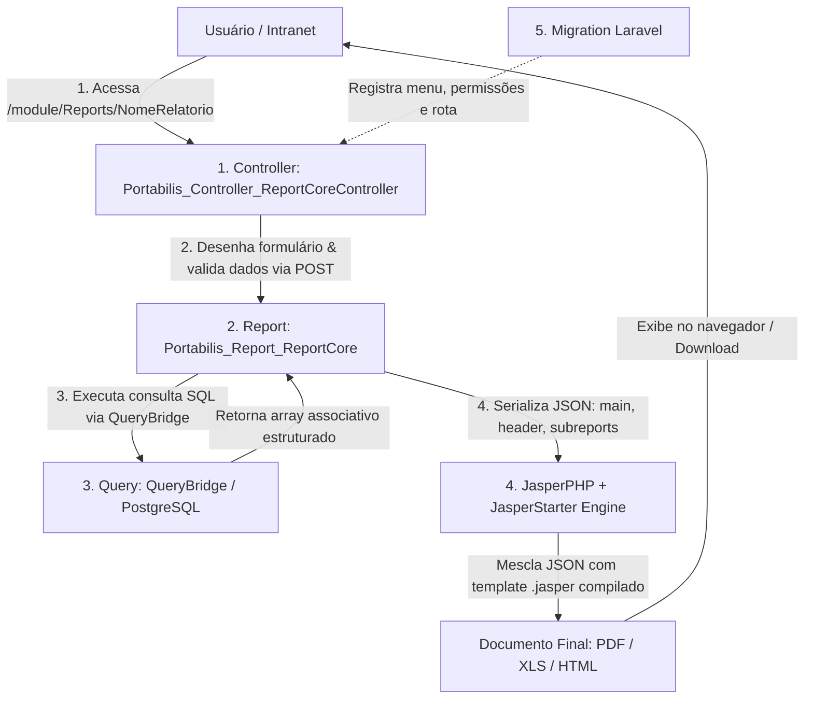

# 📘 Guia Definitivo de Arquitetura e Criação de Relatórios (i-Educar Reports)

> **Manual de Instruções e Blueprint Arquitetural para Desenvolvedores e Agentes de IA**  
> Este documento é a especificação canônica do ecossistema de relatórios do **i-Educar** (`i-educar-reports-package`). Qualquer inteligência artificial ou desenvolvedor que ler este guia deve ser capaz de criar, customizar, depurar e publicar qualquer relatório solicitado de forma autônoma, sem cometer erros de permissão, processo ou layout.

---

## 📑 Sumário

1. [Visão Geral da Arquitetura em 5 Camadas](#1-visão-geral-da-arquitetura-em-5-camadas)
2. [Estrutura Completa de Diretórios](#2-estrutura-completa-de-diretórios)
3. [Regra de Ouro: Casamento de Processo (`_processoAp`) e Menus](#3-regra-de-ouro-casamento-de-processo-_processoap-e-menus)
4. [Árvore de Módulos e Categorias Canônicas de Menus](#4-árvore-de-módulos-e-categorias-canônicas-de-menus)
5. [Camada 1: Controller de Visualização e Filtros (`ieducar/Views/`)](#5-camada-1-controller-de-visualização-e-filtros)
   - [Catálogo de Inputs Dinâmicos (`inputsHelper`)](#catálogo-de-inputs-dinâmicos-inputshelper)
   - [Campos Customizados (`select`, `text`, `date`, `boolean`)](#campos-customizados-inputshelper)
   - [Passagem de Argumentos (`addArg`)](#passagem-de-argumentos-addarg)
6. [Camada 2: Orquestrador do Relatório (`ieducar/Reports/`)](#6-camada-2-orquestrador-do-relatório)
   - [Uso da Trait `JsonDataSource`](#uso-da-trait-jsondatasource)
   - [Injeção do Cabeçalho Padrão do Sistema (`header`)](#injeção-do-cabeçalho-padrão-do-sistema)
   - [Subreports e Múltiplos DataSources JSON](#subreports-e-múltiplos-datasources-json)
7. [Camada 3: Consultas SQL e Banco de Dados (`ieducar/Queries/`)](#7-camada-3-consultas-sql-e-banco-de-dados)
   - [Padrão `QueryBridge` e Sintaxe `$P{}`](#padrão-querybridge-e-sintaxe-p)
   - [Dicionário de Dados do i-Educar (Tabelas Essenciais)](#dicionário-de-dados-do-i-educar)
   - [Cláusulas Obrigatórias e Filtros Opcionais Seguros](#cláusulas-obrigatórias-e-filtros-opcionais-seguros)
8. [Camada 4: Templates Visuais JasperReports (`ieducar/ReportSources/`)](#8-camada-4-templates-visuais-jasperreports)
   - [Dimensões de Página e Margens (Retrato vs Paisagem)](#dimensões-de-página-e-margens)
   - [Tipografia Obrigatória (`DejaVu Sans`) e Paleta de Cores](#tipografia-obrigatória-e-paleta-de-cores)
   - [Consumo do JSON (`queryString language="json"`)](#consumo-do-json)
   - [Invocação de Subreports de Cabeçalho](#invocação-de-subreports-de-cabeçalho)
   - [Quebra de Linha, Zebrado e Paginação](#quebra-de-linha-zebrado-e-paginação)
9. [Camada 5: Migrações de Banco de Dados (`database/migrations/`)](#9-camada-5-migrações-de-banco-de-dados)
   - [Estrutura Canônica da Migration](#estrutura-canônica-da-migration)
   - [Garantia de Permissões para Todos os Tipos de Usuário](#garantia-de-permissões-para-todos-os-tipos-de-usuário)
10. [Checklist Prático Passo a Passo para IA/Desenvolvedor](#10-checklist-prático-passo-a-passo-para-iadesenvolvedor)
11. [Guia de Resolução de Problemas (Troubleshooting)](#11-guia-de-resolução-de-problemas-troubleshooting)

---

## 1. Visão Geral da Arquitetura em 5 Camadas

O ecossistema de relatórios do i-Educar opera pela integração estrita de **5 camadas desacopladas**:



### Tecnologias e Dependências:
1. **PHP 8.2+ / Laravel**: Framework do core do i-Educar e do pacote de relatórios.
2. **PostgreSQL**: Banco de dados relacional (schemas `pmieducar`, `cadastro`, `modules`, `relatorio`, `public`).
3. **JasperReports 6.x + JasperStarter**: Utilitário em Java para compilar arquivos `.jrxml` em binários `.jasper` e mesclar com dados serializados em JSON.
4. **Fonte `DejaVu Sans`**: Fonte vetorial obrigatória compatível com os servidores Linux headless.

---

## 2. Estrutura Completa de Diretórios

```text
i-educar-reports-package/
├── database/
│   ├── migrations/              # Migrações que cadastram menus e permissões
│   └── sqls/                    # Funções e views PostgreSQL auxiliares
├── ieducar/
│   ├── Assets/                  # Arquivos CSS e JavaScript de suporte
│   ├── Modifiers/               # Formatadores e manipuladores de dados pós-query
│   ├── Queries/                 # Classes SQL herdando de QueryBridge
│   ├── Reports/                 # Classes Report (DataSource, template, argumentos)
│   ├── ReportSources/           # Arquivos .jrxml (código fonte) e .jasper (compilados)
│   └── Views/                   # Controllers dos formulários legados (clsBase/clsCadastro)
├── src/
│   ├── Commands/                # Comandos artisan (community:reports:compile/install/link)
│   ├── Providers/               # ReportsServiceProvider (boot, view composer, migrations)
│   └── Services/                # Serviços de regras de negócio específicas
├── install.sh                   # Script de instalação e atualização automática
└── composer.json                # Metadados e dependências do pacote
```

---

## 3. Regra de Ouro: Casamento de Processo (`_processoAp`) e Menus

> ⚠️ **ATENÇÃO CRÍTICA (NUNCA VIOLE ESTA REGRA):**  
> Todo Controller de relatório define um número inteiro único na propriedade:  
> `protected $_processoAp = 999xxx;`  
> Este número **DEVE SER RIGOROSAMENTE IDÊNTICO** ao valor da coluna `process` cadastrado na tabela `menus` do banco de dados para a rota do relatório!

### Por que isso é obrigatório?
1. **Controle de Acesso (`ProcessPolicy` e `Gate`)**:
   Quando o usuário acessa `/module/Reports/{Nome}`, o i-Educar invoca `Gate::authorize('view', $this->_processoAp)`. O Laravel busca em `pmieducar.menu_tipo_usuario` se o papel do usuário tem `visualiza = 1` para o registro de `menus` que possua `process = $this->_processoAp`. Se os valores divergirem, o acesso é negado ou falha silenciosamente.
2. **Menu Superior (`layout.topmenu.blade.php`) e Barra Lateral Ativa (`layout.menu.blade.php`)**:
   Na classe base `clsBase.inc.php`:
   ```php
   $topmenu = Menu::query()->where('process', $this->processoAp)->first();
   ```
   Se `$this->processoAp` não coincidir com o `process` da tabela `menus`:
   - `$topmenu` retornará `null`.
   - `$mainmenu` e `$menuPaths` não serão compartilhados com as views.
   - **Resultado:** A barra horizontal de menu superior desaparece completamente e o módulo na barra lateral esquerda (Escola, Servidores, etc.) perde o destaque ativo (`ieducar-sidebar-menu-active`).
3. **Faixa de IDs recomendada para novos relatórios**:
   - Utilize a faixa `999701` a `999799` ou `999801` a `999899`.
   - Sempre certifique-se de que o ID escolhido é exclusivo e não está em uso por outro controller ou menu.

---

## 4. Árvore de Módulos e Categorias Canônicas de Menus

Ao cadastrar a migration de menu do seu relatório, insira-o na categoria hierárquica correta através do campo `parent_old` (ou `parent_id`):

| Módulo Raiz | Seção Principal | Categoria Submenu | Código `parent_old` | Finalidade |
| :--- | :--- | :--- | :--- | :--- |
| **Escola** (`old: 15`) | **Relatórios** (`old: 21126`) | **Cadastrais** | `999300` | Listagens de alunos, deficiências, benefícios, aniversários, uniformes |
| **Escola** (`old: 15`) | **Relatórios** (`old: 21126`) | **Movimentações** | `999301` | Transferências, abandono, movimentação geral e mensal |
| **Escola** (`old: 15`) | **Relatórios** (`old: 21126`) | **Lançamentos** | `999922` | Notas e faltas lançadas, conferências, notas para exame |
| **Escola** (`old: 15`) | **Relatórios** (`old: 21126`) | **Matrículas** | `999923` | Alunos por turma, enturmações, mapa quantitativo de matrículas |
| **Escola** (`old: 15`) | **Relatórios** (`old: 21126`) | **Indicadores** | `999303` | Distorção idade/série, médias comparativas, melhores desempenhos |
| **Escola** (`old: 15`) | **Relatórios** (`old: 21126`) | **Auditoria** | `999924` | Auditoria de notas e faltas |
| **Escola** (`old: 15`) | **Relatórios** (`old: 21126`) | **Gerenciais** | `999827` | Acessos de usuários, logs gerais |
| **Escola** (`old: 15`) | **Documentos** (`old: 21127`) | **Atestados** | `999400` | Atestados de matrícula, frequência, vaga, termos de compromisso, autorizações |
| **Escola** (`old: 15`) | **Documentos** (`old: 21127`) | **Boletins** | `999450` | Boletim escolar do aluno, boletim do professor, canhotos |
| **Escola** (`old: 15`) | **Documentos** (`old: 21127`) | **Fichas** | `999861` | Ficha do aluno, fichas individuais (anos iniciais/finais/EJA), ficha médica |
| **Escola** (`old: 15`) | **Documentos** (`old: 21127`) | **Históricos** | `999460` | Histórico escolar oficial, conferência de histórico |
| **Escola** (`old: 15`) | **Documentos** (`old: 21127`) | **Resultados** | `999925` | Ata de resultado final, mapas finais por disciplina, conselho de classe |
| **Escola** (`old: 15`) | **Documentos** (`old: 21127`) | **Registros** | `999500` | Diários de classe, capas e contracapas |
| **Escola** (`old: 15`) | **Documentos** (`old: 21127`) | **Carteiras** | `999600` | Carteiras de estudante |
| **Servidores** (`old: 71`) | **Relatórios** (`old: 999913`) | **Cadastrais** | `999914` | Relatório cadastral de servidores, docentes e disciplinas lecionadas |
| **Servidores** (`old: 71`) | **Relatórios** (`old: 999913`) | **Indicadores** | `999915` | Quantitativo de docentes por turma, horas alocadas |
| **Servidores** (`old: 71`) | **Documentos** (`old: 999916`) | **Documentos** | `999916` | Ficha do Servidor |
| **Biblioteca** (`old: 342`) | **Relatórios** (`old: 999905`) | **Cadastrais** | `999905` | Obras, autores, editoras, clientes da biblioteca |
| **Biblioteca** (`old: 342`) | **Relatórios** (`old: 999905`) | **Empréstimos** | `999906` | Empréstimos e devoluções da biblioteca |
| **Biblioteca** (`old: 342`) | **Documentos** (`old: 999907`) | **Comprovantes** | `999907` | Comprovante de empréstimo e de devolução |
| **Transporte** (`old: 388`) | **Relatórios** (`old: 9998847`) | **Gerais** | `9998847` | Usuários do transporte escolar, motoristas, carteira de transporte |

---

## 5. Camada 1: Controller de Visualização e Filtros

O controller deve ficar em `ieducar/Views/{NomeRelatorio}Controller.php` e estender `Portabilis_Controller_ReportCoreController`.

### Exemplo Completo e Explicado:

```php
<?php

class NomeRelatorioController extends Portabilis_Controller_ReportCoreController
{
    /**
     * ID de processo exclusivo para controle de permissão e renderização do menu.
     * @var int
     */
    protected $_processoAp = 999750;

    /**
     * Título exibido no topo do formulário e na aba do navegador.
     * @var string
     */
    protected $_titulo = 'Título Descritivo do Relatório';

    /**
     * Configuração prévia de estilos e trilha de navegação (breadcrumb).
     */
    protected function _preRender()
    {
        parent::_preRender();

        Portabilis_View_Helper_Application::loadStylesheet($this, 'intranet/styles/localizacaoSistema.css');

        $this->breadcrumb('Título Descritivo do Relatório', [
            'educar_index.php' => 'Escola', // Ou 'educar_servidores_index.php' => 'Servidores'
        ]);
    }

    /**
     * Definição dos campos do formulário de filtros.
     */
    public function form()
    {
        // 1. Carregamento de filtros dinâmicos padrão (em cascata)
        $this->inputsHelper()->dynamic(['ano', 'instituicao', 'escola']);
        $this->inputsHelper()->dynamic('curso', ['required' => false]);
        $this->inputsHelper()->dynamic('serie', ['required' => false]);
        $this->inputsHelper()->dynamic('turma', ['required' => false]);
        $this->inputsHelper()->dynamic('situacaoMatricula');

        // 2. Exemplo de campo select customizado
        $this->inputsHelper()->select('modelo', [
            'label' => 'Modelo de Impressão',
            'resources' => [
                1 => 'Modelo Simplificado',
                2 => 'Modelo Completo com Notas'
            ],
            'required' => true,
            'value' => 1
        ]);

        // 3. Exemplo de campo de data
        $this->inputsHelper()->date('data_inicial', [
            'label' => 'Data Inicial',
            'required' => false
        ]);

        // Carrega os assets do dispatcher
        $this->loadResourceAssets($this->getDispatcher());
    }

    /**
     * Mapeia os dados submetidos pelo formulário para os argumentos da classe Report.
     */
    public function beforeValidation()
    {
        $this->report->addArg('ano', (int) $this->getRequest()->ano);
        $this->report->addArg('instituicao', (int) $this->getRequest()->ref_cod_instituicao);
        $this->report->addArg('escola', (int) $this->getRequest()->ref_cod_escola);
        $this->report->addArg('curso', (int) $this->getRequest()->ref_cod_curso);
        $this->report->addArg('serie', (int) $this->getRequest()->ref_cod_serie);
        $this->report->addArg('turma', (int) $this->getRequest()->ref_cod_turma);
        $this->report->addArg('situacao_matricula_id', (int) $this->getRequest()->situacao_matricula_id);
        $this->report->addArg('modelo', (int) $this->getRequest()->modelo);
        $this->report->addArg('data_inicial', (string) $this->getRequest()->data_inicial);
    }

    /**
     * Retorna a instância da classe Report correspondente.
     * @return NomeRelatorioReport
     */
    public function report()
    {
        return new NomeRelatorioReport();
    }
}
```

### Catálogo de Inputs Dinâmicos (`inputsHelper`)
Os inputs dinâmicos realizam consultas AJAX automáticas em cascata (ao selecionar a Escola, os Cursos são filtrados; ao selecionar o Curso, as Séries são filtradas, e assim por diante):

- `ano`: Ano letivo (select).
- `instituicao`: Instituição/Mantenedora (select).
- `escola`: Unidade escolar (select com busca).
- `curso`: Curso ofertado (Ensino Fundamental, Médio, etc.).
- `serie`: Série/Ano escolar.
- `turma`: Turma da escola no ano selecionado.
- `matricula`: Campo de matrícula do aluno.
- `aluno`: Seleção/busca de aluno.
- `etapa`: Etapa do curso.
- `situacaoMatricula`: Situação do aluno (Aprovado, Cursando, Transferido, etc.).

Para tornar qualquer input dinâmico opcional, passe o parâmetro:
```php
$this->inputsHelper()->dynamic('curso', ['required' => false]);
```

---

## 6. Camada 2: Orquestrador do Relatório

A classe Report reside em `ieducar/Reports/{NomeRelatorio}Report.php` e estende `Portabilis_Report_ReportCore`.

```php
<?php

use iEducar\Reports\JsonDataSource;

class NomeRelatorioReport extends Portabilis_Report_ReportCore
{
    use JsonDataSource;

    /**
     * Nome do template Jasper (arquivo .jrxml em ieducar/ReportSources/ sem extensão).
     * @return string
     */
    public function templateName()
    {
        return 'nome-relatorio';
    }

    /**
     * Validação de parâmetros obrigatórios antes da execução da query.
     */
    public function requiredArgs()
    {
        $this->addRequiredArg('ano');
        $this->addRequiredArg('instituicao');
    }

    /**
     * Retorna a instância da Query principal.
     * @return QueryNomeRelatorio
     */
    public function getQuery()
    {
        return new QueryNomeRelatorio();
    }

    /**
     * Montagem e estruturação do array JSON entregue ao JasperStarter.
     * @return array
     */
    public function getJsonData()
    {
        return [
            'main' => $this->getQuery()->get($this->args),
            'header' => Portabilis_Utils_Database::fetchPreparedQuery($this->getSqlHeaderReport())
        ];
    }
}
```

### Subreports e Múltiplos DataSources JSON
Se o relatório precisa listar dados aninhados (como notas por disciplina de cada aluno, ou ocorrências de cada aluno), você pode injetar sub-arrays dentro do método `getJsonData()` ou montar estruturas relacionais no `main`. No JasperReports, o subreport consumirá essa estrutura usando a expressão:
```xml
((net.sf.jasperreports.engine.data.JsonDataSource)$P{REPORT_DATA_SOURCE}).subDataSource("notas")
```

---

## 7. Camada 3: Consultas SQL e Banco de Dados

A classe de Query reside em `ieducar/Queries/Query{NomeRelatorio}.php` e estende `QueryBridge`.

### Padrão `QueryBridge` e Sintaxe `$P{}`
- `$P{param}`: É substituído de forma segura e tipada pelo QueryBridge. Strings recebem escape e aspas automáticas, números permanecem numéricos e booleanos viram `true`/`false`.
- `$P!{param}`: Substituição literal bruta (*raw*). Use somente para cláusulas estáticas pré-validadas ou listas de inteiros.
- **Tratamento de parâmetros opcionais (valor 0 = Todos)**:
  Sempre use a estrutura `CASE WHEN $P{param} = 0 THEN TRUE ELSE campo = $P{param} END`.

### Exemplo Completo de Query:

```php
<?php

class QueryNomeRelatorio extends QueryBridge
{
    /**
     * Define valores padrão caso o formulário não envie algum campo.
     */
    protected function getDefaultData()
    {
        return [
            'escola' => 0,
            'curso' => 0,
            'serie' => 0,
            'turma' => 0,
            'situacao_matricula_id' => 0,
        ];
    }

    /**
     * Consulta SQL pura em formato Heredoc.
     * @return string
     */
    protected function query()
    {
        return <<<'SQL'
SELECT 
    instituicao.cod_instituicao,
    escola.cod_escola,
    pessoa_escola.nome AS nome_escola,
    curso.nm_curso AS nome_curso,
    serie.nm_serie AS nome_serie,
    turma.cod_turma,
    turma.nm_turma AS nome_turma,
    turma_turno.nome AS periodo,
    aluno.cod_aluno,
    pessoa.nome AS nome_aluno,
    fisica.sexo,
    to_char(fisica.data_nasc, 'DD/MM/YYYY') AS data_nasc,
    matricula.cod_matricula,
    view_situacao.texto_situacao_simplificado AS situacao
FROM pmieducar.instituicao
INNER JOIN pmieducar.escola ON (escola.ref_cod_instituicao = instituicao.cod_instituicao)
INNER JOIN cadastro.pessoa pessoa_escola ON (pessoa_escola.idpes = escola.ref_idpes)
INNER JOIN pmieducar.escola_ano_letivo ON (escola_ano_letivo.ref_cod_escola = escola.cod_escola)
INNER JOIN pmieducar.turma ON (
    turma.ref_ref_cod_escola = escola.cod_escola 
    AND turma.ano = escola_ano_letivo.ano 
    AND turma.ativo = 1
)
INNER JOIN pmieducar.turma_turno ON (turma_turno.id = turma.turma_turno_id)
INNER JOIN pmieducar.curso ON (curso.cod_curso = turma.ref_cod_curso)
INNER JOIN pmieducar.serie ON (serie.cod_serie = turma.ref_ref_cod_serie)
INNER JOIN pmieducar.matricula_turma ON (
    matricula_turma.ref_cod_turma = turma.cod_turma 
    AND matricula_turma.ativo = 1
)
INNER JOIN pmieducar.matricula ON (
    matricula.cod_matricula = matricula_turma.ref_cod_matricula 
    AND matricula.ano = turma.ano 
    AND matricula.ativo = 1
)
INNER JOIN pmieducar.aluno ON (aluno.cod_aluno = matricula.ref_cod_aluno AND aluno.ativo = 1)
INNER JOIN cadastro.fisica ON (fisica.idpes = aluno.ref_idpes)
INNER JOIN cadastro.pessoa ON (pessoa.idpes = fisica.idpes)
INNER JOIN relatorio.view_situacao ON (
    view_situacao.cod_matricula = matricula.cod_matricula 
    AND view_situacao.cod_turma = turma.cod_turma 
    AND view_situacao.sequencial = matricula_turma.sequencial
)
WHERE instituicao.cod_instituicao = $P{instituicao}
  AND escola_ano_letivo.ano = $P{ano}
  AND (CASE WHEN $P{escola} = 0 THEN TRUE ELSE escola.cod_escola = $P{escola} END)
  AND (CASE WHEN $P{curso} = 0 THEN TRUE ELSE curso.cod_curso = $P{curso} END)
  AND (CASE WHEN $P{serie} = 0 THEN TRUE ELSE serie.cod_serie = $P{serie} END)
  AND (CASE WHEN $P{turma} = 0 THEN TRUE ELSE turma.cod_turma = $P{turma} END)
  AND (CASE WHEN $P{situacao_matricula_id} = 0 THEN TRUE ELSE view_situacao.cod_situacao = $P{situacao_matricula_id} END)
  
  -- Regra canônica: apenas a última enturmação ativa do aluno na turma (elimina duplicidade por remanejamento)
  AND matricula_turma.sequencial = (
      SELECT MAX(mt.sequencial)
      FROM pmieducar.matricula_turma mt
      WHERE mt.ref_cod_matricula = matricula.cod_matricula
        AND mt.ref_cod_turma = turma.cod_turma
  )
  -- Regra canônica: desconsidera se já houver matrícula posterior ativa na mesma turma
  AND NOT verifica_existe_matricula_posterior_mesma_turma(view_situacao.cod_matricula, view_situacao.cod_turma)

ORDER BY 
    pessoa_escola.nome,
    curso.nm_curso,
    serie.nm_serie,
    turma.nm_turma,
    relatorio.get_texto_sem_caracter_especial(public.fcn_upper(pessoa.nome))
SQL;
    }
}
```

### Dicionário de Dados do i-Educar
| Tabela / View | Finalidade Principal | Chaves e Campos Importantes |
| :--- | :--- | :--- |
| `pmieducar.instituicao` | Prefeitura / Entidade Mantenedora | `cod_instituicao`, `nm_instituicao` |
| `pmieducar.escola` | Unidade Escolar | `cod_escola`, `ref_cod_instituicao`, `ref_idpes` |
| `pmieducar.escola_ano_letivo`| Anos abertos na escola | `ref_cod_escola`, `ano`, `ativo` |
| `pmieducar.curso` | Nível de Ensino (Fundamental, Médio) | `cod_curso`, `nm_curso`, `padrao_ano_escolar` |
| `pmieducar.serie` | Ano/Série do curso | `cod_serie`, `nm_serie`, `ref_cod_curso` |
| `pmieducar.turma` | Enturmação física de alunos | `cod_turma`, `nm_turma`, `ano`, `turma_turno_id`, `ativo` |
| `pmieducar.turma_turno` | Período da turma | `id`, `nome` (Matutino, Vespertino, etc.) |
| `pmieducar.aluno` | Registro do Aluno | `cod_aluno`, `ref_idpes`, `ativo` |
| `cadastro.pessoa` | Entidade Pessoa (Nome) | `idpes`, `nome`, `email` |
| `cadastro.fisica` | Dados civis de Pessoa Física | `idpes`, `sexo`, `data_nasc`, `cpf`, `nis_pis_pasep` |
| `pmieducar.matricula` | Registro anual da matrícula | `cod_matricula`, `ano`, `aprovado`, `dependencia`, `ativo` |
| `pmieducar.matricula_turma`| Vínculo do aluno na turma | `ref_cod_matricula`, `ref_cod_turma`, `sequencial`, `ativo` |
| `relatorio.view_situacao` | Situação calculada oficial | `cod_matricula`, `cod_turma`, `sequencial`, `texto_situacao_simplificado` |
| `modules.nota_aluno` | Cabeçalho das notas do aluno | `id`, `matricula_id` |
| `modules.nota_componente_curricular_media` | Médias e notas por disciplina | `nota_aluno_id`, `componente_curricular_id`, `media`, `media_arredondada` |
| `relatorio.view_componente_curricular` | Disciplinas da turma ordenadas | `id`, `nome`, `abreviatura`, `ordenamento`, `cod_turma` |

---

## 8. Camada 4: Templates Visuais JasperReports

O arquivo fonte `.jrxml` reside em `ieducar/ReportSources/{nome-relatorio}.jrxml`.

### Dimensões de Página e Margens
- **Retrato (Portrait)**: `pageWidth="595"`, `pageHeight="842"`, `columnWidth="555"`, margens `20` pt.
- **Paisagem (Landscape)**: `pageWidth="842"`, `pageHeight="595"`, `columnWidth="802"`, margens `20` pt.

### Tipografia Obrigatória e Paleta de Cores
- **Fonte Padrão**: Sempre utilize `fontName="DejaVu Sans"` em todos os `<font>` tags. Nunca utilize Arial, Calibri ou Times, pois causarão erro de compilação ou texto desalinhado no container Linux do servidor.
- **Hierarquia de Tamanhos**:
  - Título Principal: `size="10"` a `12`, `isBold="true"`
  - Seções / Grupos: `size="8"`, `isBold="true"`
  - Cabeçalho de Colunas: `size="7"` ou `8`, `isBold="true"`, fundo `#EDEDED`
  - Linhas de Dados (`detail`): `size="7"` ou `8`, `isBold="false"`
  - Totais e Rodapés: `size="7"`, `isBold="true"`
- **Zebrado Automático**: Adicione no início da banda `<detail>` um retângulo com:
  ```xml
  <rectangle>
      <reportElement stretchType="RelativeToTallestObject" x="0" y="0" width="555" height="14" backcolor="#F7F7F7" uuid="zebrado">
          <printWhenExpression><![CDATA[new Boolean($V{REPORT_COUNT}.intValue() % 2 == 0)]]></printWhenExpression>
      </reportElement>
      <graphicElement><pen lineWidth="0.0"/></graphicElement>
  </rectangle>
  ```

### Consumo do JSON
Defina no início do relatório:
```xml
<queryString language="json"><![CDATA[main]]></queryString>

<field name="cod_aluno" class="java.lang.Integer"/>
<field name="nome_aluno" class="java.lang.String"/>
<field name="sexo" class="java.lang.String"/>
<field name="data_nasc" class="java.lang.String"/>
<field name="situacao" class="java.lang.String"/>
```

### Invocação do Cabeçalho Padrão do Sistema
Na banda `<pageHeader>` ou no `<groupHeader>` de Turma/Escola:
```xml
<subreport>
    <reportElement x="0" y="0" width="555" height="80" uuid="subreport-cabecalho"/>
    <subreportParameter name="logo"><subreportParameterExpression><![CDATA[$P{logo}]]></subreportParameterExpression></subreportParameter>
    <subreportParameter name="titulo"><subreportParameterExpression><![CDATA["RELAÇÃO OFICIAL DE ALUNOS"]]></subreportParameterExpression></subreportParameter>
    <subreportParameter name="cod_instituicao"><subreportParameterExpression><![CDATA[$P{instituicao}]]></subreportParameterExpression></subreportParameter>
    <subreportParameter name="cod_escola"><subreportParameterExpression><![CDATA[$F{cod_escola}]]></subreportParameterExpression></subreportParameter>
    <subreportParameter name="ano"><subreportParameterExpression><![CDATA[$P{ano}]]></subreportParameterExpression></subreportParameter>
    <subreportParameter name="data_emissao"><subreportParameterExpression><![CDATA[$P{data_emissao}]]></subreportParameterExpression></subreportParameter>
    <subreportParameter name="source"><subreportParameterExpression><![CDATA[$P{source}]]></subreportParameterExpression></subreportParameter>
    <subreportExpression><![CDATA[$P{SUBREPORT_DIR} + "header-portrait.jasper"]]></subreportExpression>
</subreport>
```
*(Para relatórios em paisagem, utilize `header-landscape.jasper` e `width="802"`).*

---

## 9. Camada 5: Migrações de Banco de Dados

A migration Laravel cadastra o item de menu e garante as permissões para todos os tipos de usuário existentes. Deve residir em `database/migrations/YYYY_MM_DD_HHMMSS_add_{nome_relatorio}_menu.php`.

### Estrutura Canônica da Migration:

```php
<?php

use App\Menu;
use Illuminate\Database\Migrations\Migration;
use Illuminate\Support\Facades\DB;
use Illuminate\Support\Facades\Schema;

class AddNomeRelatorioMenu extends Migration
{
    /**
     * Disable transaction para permitir execuções parciais seguras.
     */
    public $withinTransaction = false;

    public function up()
    {
        $processId = 999750; // ID único rigorosamente igual ao $_processoAp do Controller
        $parentOld = 999300; // Código da categoria pai (ex: 999300 = Cadastrais)
        $title = 'Título Descritivo do Relatório';
        $link = '/module/Reports/NomeRelatorio';

        // 1. Localiza o menu pai
        $parentMenu = Menu::query()->where('old', $parentOld)->first();
        $parentId = $parentMenu ? $parentMenu->getKey() : null;

        // 2. Insere ou atualiza o item de menu
        $menu = Menu::query()->updateOrCreate(
            ['link' => $link],
            [
                'parent_id' => $parentId,
                'parent_old' => $parentOld,
                'process' => $processId,
                'title' => $title,
                'order' => 15,
                'old' => $processId
            ]
        );

        // 3. Garante permissão total para TODOS os tipos de usuário existentes
        try {
            $permTable = Schema::hasTable('menu_tipo_usuario') 
                ? 'menu_tipo_usuario' 
                : (Schema::hasTable('pmieducar.menu_tipo_usuario') ? 'pmieducar.menu_tipo_usuario' : null);

            if ($permTable) {
                $columns = Schema::getColumnListing($permTable);
                $tipoUsuarioTable = Schema::hasTable('tipo_usuario') ? 'tipo_usuario' : 'pmieducar.tipo_usuario';
                $tipos = DB::table($tipoUsuarioTable)->pluck('cod_tipo_usuario')->all();

                $fkCol = in_array('ref_cod_tipo_usuario', $columns) ? 'ref_cod_tipo_usuario' : 'tipo_usuario_id';

                foreach ($tipos as $tipoId) {
                    DB::table($permTable)->updateOrInsert(
                        [
                            $fkCol => $tipoId,
                            'menu_id' => $menu->getKey()
                        ],
                        [
                            'visualiza' => 1,
                            'cadastra' => 1,
                            'exclui' => 1
                        ]
                    );
                }
            }
        } catch (\Throwable $e) {
            // Ignora falhas isoladas de permissão para não abortar a migration
        }
    }

    public function down()
    {
        Menu::query()->where('link', '/module/Reports/NomeRelatorio')->delete();
    }
}
```

---

## 10. Checklist Prático Passo a Passo para IA/Desenvolvedor

Quando solicitado a criar um novo relatório, siga rigorosamente esta sequência de 7 passos:

```text
[ ] PASSO 1: Escolher um Nome de Ação (CamelCase) e um ID de Processo Único
    Exemplo: Ação = 'StudentTransportSurvey', ID de Processo = 999751.
    Certifique-se de que o ID não está em uso por outro relatório.

[ ] PASSO 2: Criar o Controller em `ieducar/Views/{Acao}Controller.php`
    - Definir `protected $_processoAp = 999751;`
    - Definir `protected $_titulo = 'Nome do Relatório';`
    - Configurar os filtros em `form()` via `$this->inputsHelper()`.
    - Mapear os parâmetros em `beforeValidation()`.
    - Retornar a instância de `{Acao}Report` em `report()`.

[ ] PASSO 3: Criar o Report em `ieducar/Reports/{Acao}Report.php`
    - Adicionar `use JsonDataSource;`
    - Retornar o nome do arquivo em `templateName()` (em kebab-case: `student-transport-survey`).
    - Configurar argumentos obrigatórios em `requiredArgs()`.
    - Instanciar a Query em `getQuery()` e montar o JSON em `getJsonData()`.

[ ] PASSO 4: Criar a Query SQL em `ieducar/Queries/Query{Acao}.php`
    - Estender `QueryBridge`.
    - Definir valores default em `getDefaultData()`.
    - Escrever o SQL com Heredoc `<<<'SQL'`, utilizando `$P{}` para filtros.
    - Aplicar a desduplicação de enturmação e a ordenação sem caracteres especiais.

[ ] PASSO 5: Criar o Layout JRXML em `ieducar/ReportSources/{nome-kebab}.jrxml`
    - Definir página, margens e `queryString language="json"`.
    - Utilizar exclusivamente a fonte `fontName="DejaVu Sans"`.
    - Incluir o subreport de cabeçalho padrão (`header-portrait.jasper` ou `header-landscape.jasper`).
    - Configurar cabeçalhos de coluna, zebrado na banda `<detail>` e paginação no `<pageFooter>`.

[ ] PASSO 6: Criar a Migration em `database/migrations/YYYY_MM_DD_HHMMSS_add_{acao}_menu.php`
    - Definir `process` e `old` com o mesmo ID do Controller.
    - Vincular ao `parent_old` correto da categoria de menus.
    - Inserir as permissões em `menu_tipo_usuario` para todos os papéis.

[ ] PASSO 7: Compilar e Publicar
    Executar no terminal da aplicação:
    1. `php artisan community:reports:compile`
    2. `php artisan migrate --force`
    3. `php artisan view:clear && php artisan cache:clear && php artisan config:clear`
```

---

## 11. Guia de Resolução de Problemas (Troubleshooting)

### 1. Menu superior some e módulo lateral perde destaque
- **Causa**: Discrepância entre `$_processoAp` declarado no Controller e o valor gravado na coluna `process` da tabela `menus`.
- **Solução**: Verifique o `$_processoAp` da classe do controller e execute um `UPDATE menus SET process = X WHERE link = '/module/Reports/...'`. No pacote, o `ReportsServiceProvider` possui um View Composer que atua como fallback automático pelo `link`.

### 2. Erro 404 ao clicar no link do relatório
- **Causa**: O link simbólico entre a pasta de views do pacote e a pasta de módulos legados do i-Educar não está criado.
- **Solução**: Execute `php artisan community:reports:link` na raiz do projeto.

### 3. Erro de compilação Java no JasperStarter
- **Causa 1**: Uso de fontes proprietárias (Arial, Calibri). Altere todas as tags `<font>` para `fontName="DejaVu Sans"`.
- **Causa 2**: Sintaxe Java inválida em `$F{...}` ou `$P{...}`. Lembre-se de que o JasperReports avalia expressões em linguagem Java estrita.
- **Solução**: Compile manualmente para ver o stack trace completo:
  ```bash
  vendor/cossou/jasperphp/src/JasperStarter/bin/jasperstarter compile ieducar/ReportSources/seu-relatorio.jrxml
  ```

### 4. Relatório é gerado totalmente em branco
- **Causa**: A consulta SQL retornou zero linhas e o relatório não possui a propriedade para exibir seções vazias.
- **Solução**: Adicione no cabeçalho do `<jasperReport>` o atributo `whenNoDataType="AllSectionsNoDetail"`, e certifique-se de que os filtros enviados no formulário casam com dados existentes no banco de teste.

### 5. Erro `index.php?negado=1&err=1` (Permissão Negada)
- **Causa**: O usuário autenticado não possui registro em `pmieducar.menu_tipo_usuario` para o `menu_id` correspondente.
- **Solução**: Certifique-se de que a migration inseriu o registro com `visualiza = 1` para o `cod_tipo_usuario` do seu usuário ou execute a migration canônica de restauração de permissões.

---

*(Fim do Guia Canônico - Mantenha este documento atualizado a cada novo padrão arquitetural introduzido no pacote).*
