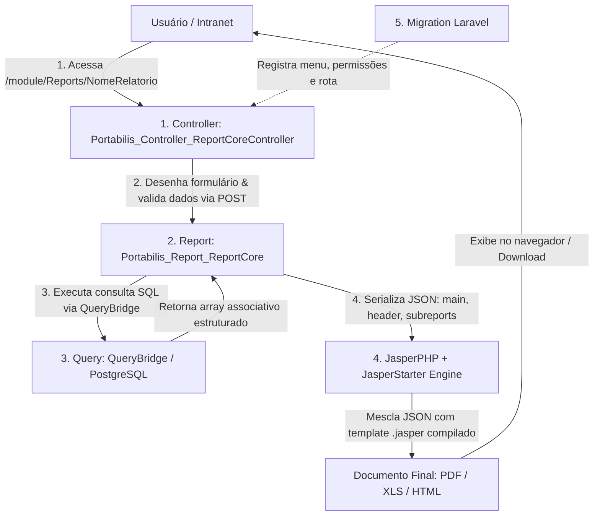

# 📘 Guia Definitivo de Arquitetura e Criação de Relatórios (i-Educar Reports)

> **Manual de Instruções e Blueprint Arquitetural para Desenvolvedores e Agentes de IA**  
> Este documento é a especificação canônica do ecossistema de relatórios do **i-Educar** (`i-educar-reports-package`). Qualquer inteligência artificial ou desenvolvedor que ler este guia deve ser capaz de criar, customizar, depurar e publicar qualquer relatório solicitado de forma autônoma, sem cometer erros de permissão, processo ou layout.

---

## 📑 Sumário

1. [Visão Geral da Arquitetura em 5 Camadas](#1-visão-geral-da-arquitetura-em-5-camadas)
2. [Estrutura Completa de Diretórios](#2-estrutura-completa-de-diretórios)
3. [Regra de Ouro: Casamento de Processo (`_processoAp`) e Menus](#3-regra-de-ouro-casamento-de-processo-_processoap-e-menus)
4. [Árvore de Módulos e Categorias Canônicas de Menus](#4-árvore-de-módulos-e-categorias-canônicas-de-menus)
5. [Camada 1: Controller de Visualização e Filtros (`ieducar/Views/`)](#5-camada-1-controller-de-visualização-e-filtros)
   - [Catálogo de Inputs Dinâmicos (`inputsHelper`)](#catálogo-de-inputs-dinâmicos-inputshelper)
   - [Exemplos Práticos de Inputs Customizados (`select`, `text`, `date`, `boolean`, `radio`)](#exemplos-práticos-de-inputs-customizados)
   - [Extração Segura e Passagem de Argumentos (`beforeValidation`)](#extração-segura-e-passagem-de-argumentos)
6. [Camada 2: Orquestrador do Relatório (`ieducar/Reports/`)](#6-camada-2-orquestrador-do-relatório)
   - [Uso da Trait `JsonDataSource`](#uso-da-trait-jsondatasource)
   - [Injeção do Cabeçalho Padrão do Sistema (`header`)](#injeção-do-cabeçalho-padrão-do-sistema)
   - [Subreports e Múltiplos DataSources JSON (Arquitetura Multi-Nó)](#subreports-e-múltiplos-datasources-json)
7. [Camada 3: Consultas SQL e Banco de Dados (`ieducar/Queries/`)](#7-camada-3-consultas-sql-e-banco-de-dados)
   - [Padrão `QueryBridge` e Sintaxe `$P{}` / `$P!{}`](#padrão-querybridge-e-sintaxe-p)
   - [Dicionário de Dados do i-Educar (Tabelas Essenciais)](#dicionário-de-dados-do-i-educar)
   - [Padrões Práticos de Filtros SQL (Opcionais, Datas, Busca Textual)](#padrões-práticos-de-filtros-sql)
   - [Padrão Obrigatório de Desduplicação de Enturmação](#padrão-obrigatório-de-desduplicação-de-enturmação)
8. [Camada 4: Templates Visuais JasperReports (`ieducar/ReportSources/`)](#8-camada-4-templates-visuais-jasperreports)
   - [Dimensões de Página e Margens (Retrato vs Paisagem)](#dimensões-de-página-e-margens)
   - [Tipografia Obrigatória (`DejaVu Sans`) e Paleta de Cores](#tipografia-obrigatória-e-paleta-de-cores)
   - [Guia de Expressões Java no JasperReports (Ternários, Formatações e Null Checks)](#guia-de-expressões-java-no-jasperreports)
   - [Zebrado Automático, Agrupamento e Variáveis de Totalização](#zebrado-automático-agrupamento-e-variáveis-de-totalização)
9. [Camada 5: Migrações de Banco de Dados (`database/migrations/`)](#9-camada-5-migrações-de-banco-de-dados)
   - [Estrutura Canônica da Migration](#estrutura-canônica-da-migration)
   - [Garantia de Permissões para Todos os Tipos de Usuário](#garantia-de-permissões-para-todos-os-tipos-de-usuário)
10. [Exemplos Práticos Completos de Ponta a Ponta (End-to-End)](#10-exemplos-práticos-completos-de-ponta-a-ponta)
    - [Exemplo 1: Listagem Cadastral em Tabela Retrato (A4 Portrait)](#exemplo-1-listagem-cadastral-em-tabela-retrato-a4-portrait)
    - [Exemplo 2: Documento Individual / Declaração Oficial com Assinatura](#exemplo-2-documento-individual--declaração-oficial-com-assinatura)
    - [Exemplo 3: Relatório Amplo em Paisagem (A4 Landscape - 802pt)](#exemplo-3-relatório-amplo-em-paisagem-a4-landscape---802pt)
    - [Exemplo 4: Relatório Master-Detail com Subreport e DataSources Aninhados](#exemplo-4-relatório-master-detail-com-subreport-e-datasources-aninhados)
11. [Checklist Prático Passo a Passo para IA/Desenvolvedor](#11-checklist-prático-passo-a-passo-para-iadesenvolvedor)
12. [Guia de Resolução de Problemas (Troubleshooting)](#12-guia-de-resolução-de-problemas-troubleshooting)

---

## 1. Visão Geral da Arquitetura em 5 Camadas

O ecossistema de relatórios do i-Educar opera pela integração estrita de **5 camadas desacopladas**:



### Tecnologias e Dependências:
1. **PHP 8.2+ / Laravel**: Framework do core do i-Educar e do pacote de relatórios.
2. **PostgreSQL**: Banco de dados relacional (schemas `pmieducar`, `cadastro`, `modules`, `relatorio`, `public`).
3. **JasperReports 6.x + JasperStarter**: Utilitário em Java para compilar arquivos `.jrxml` em binários `.jasper` e mesclar com dados serializados em JSON.
4. **Fonte `DejaVu Sans`**: Fonte vetorial obrigatória compatível com os servidores Linux headless.

---

## 2. Estrutura Completa de Diretórios

```text
i-educar-reports-package/
├── database/
│   ├── migrations/              # Migrações que cadastram menus e permissões
│   └── sqls/                    # Funções e views PostgreSQL auxiliares
├── ieducar/
│   ├── Assets/                  # Arquivos CSS e JavaScript de suporte
│   ├── Modifiers/               # Formatadores e manipuladores de dados pós-query
│   ├── Queries/                 # Classes SQL herdando de QueryBridge
│   ├── Reports/                 # Classes Report (DataSource, template, argumentos)
│   ├── ReportSources/           # Arquivos .jrxml (código fonte) e .jasper (compilados)
│   └── Views/                   # Controllers dos formulários legados (clsBase/clsCadastro)
├── src/
│   ├── Commands/                # Comandos artisan (community:reports:compile/install/link)
│   ├── Providers/               # ReportsServiceProvider (boot, view composer, migrations)
│   └── Services/                # Serviços de regras de negócio específicas
├── install.sh                   # Script de instalação e atualização automática
└── composer.json                # Metadados e dependências do pacote
```

---

## 3. Regra de Ouro: Casamento de Processo (`_processoAp`) e Menus

> ⚠️ **ATENÇÃO CRÍTICA (NUNCA VIOLE ESTA REGRA):**  
> Todo Controller de relatório define um número inteiro único na propriedade:  
> `protected $_processoAp = 999xxx;`  
> Este número **DEVE SER RIGOROSAMENTE IDÊNTICO** ao valor da coluna `process` cadastrado na tabela `menus` do banco de dados para a rota do relatório!

### Por que isso é obrigatório?
1. **Controle de Acesso (`ProcessPolicy` e `Gate`)**:
   Quando a requisição chega em `/module/Reports/{NomeRelatorio}`, o core do i-Educar verifica se o usuário autenticado possui permissão de leitura para aquele `process`. Se o ID não casar com o banco, o sistema aborta com tela de **Permissão Negada (`?negado=1`)**.
2. **Construção do Layout (`clsBase::MakeAll()`)**:
   O i-Educar carrega o cabeçalho global e a barra lateral com base na consulta:
   `SELECT * FROM menus WHERE process = $this->_processoAp`.
   Se o ID for inexistente na tabela `menus`, a consulta retorna nulo, fazendo com que:
   - O menu superior horizontal **DESAPAREÇA** completamente.
   - O módulo lateral perca a marcação ativa (`ieducar-sidebar-menu-active`).
   - O título da página fique em branco ou genérico.

---

## 4. Árvore de Módulos e Categorias Canônicas de Menus

Ao criar a migration de um novo relatório, ele deve ser posicionado sob uma das categorias pai oficiais da tabela `menus`:

| Módulo Principal | Menu Pai Intermediário | Subcategoria / Categoria Pai | `parent_old` Oficial | Finalidade Típica |
| :--- | :--- | :--- | :--- | :--- |
| **Escola** (`old: 555`) | **Relatórios** (`old: 999923`) | **Cadastrais** | `999300` | Listagens de alunos, servidores, turmas, transporte |
| **Escola** (`old: 555`) | **Relatórios** (`old: 999923`) | **Frequência** | `999301` | Mapas de faltas, boletins de presença |
| **Escola** (`old: 555`) | **Relatórios** (`old: 999923`) | **Notas** | `999303` | Boletins, atas de resultados finais, médias |
| **Escola** (`old: 555`) | **Documentos** (`old: 999922`) | **Atestados / Declarações** | `999400` | Declarações de matrícula, transferência, frequência |
| **Escola** (`old: 555`) | **Documentos** (`old: 999922`) | **Certificados / Diplomas** | `999450` | Certificados de conclusão de curso/série |
| **Escola** (`old: 555`) | **Documentos** (`old: 999922`) | **Históricos** | `999861` | Histórico escolar do ensino fundamental e médio |
| **Escola** (`old: 555`) | **Documentos** (`old: 999922`) | **Fichas Individuais** | `999460` | Ficha individual do aluno, prontuário |
| **Escola** (`old: 555`) | **Documentos** (`old: 999922`) | **Carteiras** | `999925` | Carteira de estudante, crachá escolar |
| **Escola** (`old: 555`) | **Documentos** (`old: 999922`) | **Comprovantes** | `999500` | Comprovante de matrícula, termo de entrega |
| **Escola** (`old: 555`) | **Documentos** (`old: 999922`) | **Gráficos** | `999600` | Demonstrativos estatísticos gráficos |
| **Servidores** (`old: 71`) | **Relatórios** (`old: 999914`) | **Cadastrais** | `999915` | Ficha do servidor, alocação de docentes, cargos |
| **Servidores** (`old: 71`) | **Documentos** (`old: 999916`) | **Declarações** | `999916` | Declaração de lotação, tempo de serviço |
| **Biblioteca** (`old: 342`) | **Relatórios** (`old: 999905`) | **Cadastrais** | `999905` | Obras, autores, editoras, clientes da biblioteca |
| **Biblioteca** (`old: 342`) | **Relatórios** (`old: 999905`) | **Empréstimos** | `999906` | Empréstimos e devoluções da biblioteca |
| **Biblioteca** (`old: 342`) | **Documentos** (`old: 999907`) | **Comprovantes** | `999907` | Comprovante de empréstimo e de devolução |
| **Transporte** (`old: 388`) | **Relatórios** (`old: 9998847`) | **Gerais** | `9998847` | Usuários do transporte escolar, itinerários, veículos |

---

## 5. Camada 1: Controller de Visualização e Filtros

O controller deve ficar em `ieducar/Views/{NomeRelatorio}Controller.php` e estender `Portabilis_Controller_ReportCoreController`.

### Catálogo de Inputs Dinâmicos (`inputsHelper`)
Os inputs dinâmicos realizam consultas AJAX automáticas em cascata:
- `ano`: Ano letivo (select automático dos anos letivos abertos).
- `instituicao`: Entidade mantenedora (prefeitura/rede).
- `escola`: Unidade escolar (filtrada pela instituição selecionada).
- `curso`: Curso ofertado (filtrado pela escola).
- `serie`: Série/ano escolar (filtrada pelo curso).
- `turma`: Turma da escola no ano selecionado (filtrada pela série/escola/ano).
- `matricula`: Campo de matrícula do estudante com autocomplete.
- `aluno`: Seleção de estudante.
- `etapa`: Etapa do curso.
- `situacaoMatricula`: Situação oficial do aluno (Aprovado, Reprovado, Cursando, etc.).

#### Chamada Padrão em Bloco:
```php
$this->inputsHelper()->dynamic(['ano', 'instituicao', 'escola', 'curso', 'serie', 'turma']);
```

#### Tornando um Input Dinâmico Opcional:
```php
$this->inputsHelper()->dynamic(['ano', 'instituicao', 'escola']);
$this->inputsHelper()->dynamic('curso', ['required' => false]);
$this->inputsHelper()->dynamic('serie', ['required' => false]);
$this->inputsHelper()->dynamic('turma', ['required' => false]);
```

---

### Exemplos Práticos de Inputs Customizados

#### 1. Campo Select Estático:
```php
$this->inputsHelper()->select('situacao', [
    'label' => 'Situação da Matrícula',
    'resources' => [
        0 => 'Todas as situações',
        1 => 'Aprovado',
        2 => 'Reprovado',
        3 => 'Cursando',
        4 => 'Transferido',
        6 => 'Abandono'
    ],
    'required' => false,
    'value' => 0
]);
```

#### 2. Campo Select Dinâmico Populado por Consulta SQL:
```php
// Consulta direta via DB::table() ou Modelo
$turnos = \Illuminate\Support\Facades\DB::table('pmieducar.turma_turno')
    ->orderBy('nome')
    ->pluck('nome', 'id')
    ->all();

$this->inputsHelper()->select('turno_id', [
    'label' => 'Turno Escolar',
    'resources' => [0 => 'Todos os turnos'] + $turnos,
    'required' => false,
    'value' => 0
]);
```

#### 3. Campo de Data com Máscara e Placeholder:
```php
$this->inputsHelper()->date('data_inicial', [
    'label' => 'Data Inicial da Matrícula',
    'required' => false,
    'placeholder' => 'dd/mm/aaaa',
    'value' => ''
]);

$this->inputsHelper()->date('data_final', [
    'label' => 'Data Final da Matrícula',
    'required' => false,
    'placeholder' => 'dd/mm/aaaa',
    'value' => date('d/m/Y')
]);
```

#### 4. Campo Texto Simples:
```php
$this->inputsHelper()->text('observacao', [
    'label' => 'Observação / Texto Personalizado',
    'required' => false,
    'size' => 60,
    'max_length' => 255,
    'placeholder' => 'Texto que será impresso no corpo do documento...'
]);
```

#### 5. Campo Booleano (Checkbox):
```php
$this->inputsHelper()->boolean('imprimir_assinatura', [
    'label' => 'Exibir campos de assinatura do diretor e secretário(a)?',
    'value' => true
]);
```

---

### Extração Segura e Passagem de Argumentos

No método `beforeValidation()`, faça a sanitização estrita e conversão de tipos de cada campo recebido do formulário:

```php
public function beforeValidation()
{
    // Inputs Dinâmicos (Sempre converter IDs para int)
    $this->report->addArg('ano', (int) $this->getRequest()->ano);
    $this->report->addArg('instituicao', (int) $this->getRequest()->ref_cod_instituicao);
    $this->report->addArg('escola', (int) $this->getRequest()->ref_cod_escola);
    $this->report->addArg('curso', (int) $this->getRequest()->ref_cod_curso);
    $this->report->addArg('serie', (int) $this->getRequest()->ref_cod_serie);
    $this->report->addArg('turma', (int) $this->getRequest()->ref_cod_turma);
    $this->report->addArg('matricula', (int) $this->getRequest()->ref_cod_matricula);

    // Inputs Customizados
    $this->report->addArg('situacao', (int) $this->getRequest()->situacao);
    $this->report->addArg('turno_id', (int) $this->getRequest()->turno_id);
    $this->report->addArg('observacao', trim((string) $this->getRequest()->observacao));
    $this->report->addArg('imprimir_assinatura', (bool) $this->getRequest()->imprimir_assinatura);

    // Datas: Converter de DD/MM/YYYY para YYYY-MM-DD se preenchido
    $dataIni = $this->getRequest()->data_inicial;
    $this->report->addArg('data_inicial', $dataIni ? Portabilis_Date_Utils::brToPgSQL($dataIni) : '');

    $dataFim = $this->getRequest()->data_final;
    $this->report->addArg('data_final', $dataFim ? Portabilis_Date_Utils::brToPgSQL($dataFim) : '');
}
```

---

## 6. Camada 2: Orquestrador do Relatório

A classe Report reside em `ieducar/Reports/{NomeRelatorio}Report.php` e estende `Portabilis_Report_ReportCore`.

### Uso da Trait `JsonDataSource`
Todo relatório moderno do i-Educar utiliza a trait `JsonDataSource`. Ela serializa os arrays retornados pelas queries em arquivos temporários `.json` e invoca o motor de geração de PDF.

```php
<?php

use iEducar\Reports\JsonDataSource;

class NomeRelatorioReport extends Portabilis_Report_ReportCore
{
    use JsonDataSource;

    public function templateName()
    {
        // Retorna o nome base do arquivo .jrxml sem a extensão
        return 'nome-relatorio-kebab';
    }

    public function requiredArgs()
    {
        // Argumentos que causam erro se não forem passados
        $this->addRequiredArg('ano');
        $this->addRequiredArg('instituicao');
        $this->addRequiredArg('escola');
    }

    public function getQuery()
    {
        return new QueryNomeRelatorio();
    }

    public function getJsonData()
    {
        return [
            'main' => $this->getQuery()->get($this->args),
            'header' => Portabilis_Utils_Database::fetchPreparedQuery($this->getSqlHeaderReport())
        ];
    }
}
```

---

### Subreports e Múltiplos DataSources JSON

Quando o relatório possui seções com relacionamentos 1-para-N (por exemplo: um aluno possui múltiplas notas, ou uma escola possui múltiplas turmas), você pode gerar nós aninhados no JSON:

#### No arquivo Report PHP:
```php
public function getJsonData()
{
    return [
        'main' => $this->getQuery()->get($this->args),
        'grades' => (new QueryStudentGrades())->get($this->args),
        'header' => Portabilis_Utils_Database::fetchPreparedQuery($this->getSqlHeaderReport())
    ];
}
```

#### No arquivo JRXML Master:
Para passar os dados do nó filho para o subrelatório JasperReports, utilize a expressão:
```xml
<subreport>
    <reportElement x="0" y="50" width="555" height="40" uuid="sub-notas"/>
    <subreportParameter name="matricula_id">
        <subreportParameterExpression><![CDATA[$F{cod_matricula}]]></subreportParameterExpression>
    </subreportParameter>
    <dataSourceExpression><![CDATA[((net.sf.jasperreports.engine.data.JsonDataSource)$P{REPORT_DATA_SOURCE}).subDataSource("grades")]]></dataSourceExpression>
    <subreportExpression><![CDATA[$P{SUBREPORT_DIR} + "student-report-card-grades.jasper"]]></subreportExpression>
</subreport>
```

---

## 7. Camada 3: Consultas SQL e Banco de Dados

A classe de Query reside em `ieducar/Queries/Query{NomeRelatorio}.php` e estende `QueryBridge`.

### Padrão `QueryBridge` e Sintaxe `$P{}`
- `$P{param}`: É substituído de forma segura e tipada pelo QueryBridge. Strings recebem escape e aspas automáticas, números permanecem numéricos e booleanos viram `true`/`false`.
- `$P!{param}`: Substituição literal bruta (*raw*). Use somente para cláusulas estáticas pré-validadas ou listas de inteiros.

---

### Dicionário de Dados do i-Educar

| Tabela / View | Finalidade Principal | Chaves e Campos Importantes |
| :--- | :--- | :--- |
| `pmieducar.instituicao` | Mantenedora / Prefeitura | `cod_instituicao`, `nm_instituicao` |
| `pmieducar.escola` | Unidade Escolar | `cod_escola`, `ref_cod_instituicao`, `ref_idpes` |
| `pmieducar.curso` | Nível de Ensino (Fundamental, Médio) | `cod_curso`, `nm_curso`, `padrao_ano_escolar` |
| `pmieducar.serie` | Ano/Série do curso | `cod_serie`, `nm_serie`, `ref_cod_curso` |
| `pmieducar.turma` | Turma de alunos | `cod_turma`, `nm_turma`, `ano`, `turma_turno_id`, `ativo` |
| `pmieducar.turma_turno` | Turno de funcionamento | `id`, `nome` (Matutino, Vespertino, Noturno, Integral) |
| `pmieducar.aluno` | Cadastro do Estudante | `cod_aluno`, `ref_idpes`, `ativo` |
| `cadastro.pessoa` | Entidade Pessoa Física/Jurídica | `idpes`, `nome`, `email` |
| `cadastro.fisica` | Dados civis de Pessoa Física | `idpes`, `sexo`, `data_nasc`, `cpf`, `nis_pis_pasep` |
| `pmieducar.matricula` | Registro anual da matrícula | `cod_matricula`, `ano`, `aprovado`, `dependencia`, `ativo` |
| `pmieducar.matricula_turma`| Enturmação do aluno | `ref_cod_matricula`, `ref_cod_turma`, `sequencial`, `ativo` |
| `relatorio.view_situacao` | Situação calculada oficial | `cod_matricula`, `cod_turma`, `sequencial`, `texto_situacao_simplificado` |

---

### Padrões Práticos de Filtros SQL

#### 1. Filtro Opcional de Inteiros (Valor 0 = "Todos"):
```sql
WHERE instituicao.cod_instituicao = $P{instituicao}
  AND (escola.cod_escola = $P{escola} OR $P{escola} = 0)
  AND (curso.cod_curso = $P{curso} OR $P{curso} = 0)
  AND (serie.cod_serie = $P{serie} OR $P{serie} = 0)
  AND (turma.cod_turma = $P{turma} OR $P{turma} = 0)
  AND (matricula.ano = $P{ano} OR $P{ano} = 0)
```

#### 2. Filtro Opcional de Período por Datas:
```sql
  AND ($P{data_inicial}::varchar = '' OR matricula.data_matricula >= to_date($P{data_inicial}, 'YYYY-MM-DD'))
  AND ($P{data_final}::varchar = '' OR matricula.data_matricula <= to_date($P{data_final}, 'YYYY-MM-DD'))
```

#### 3. Busca Textual Imune a Acentos e Maiúsculas:
```sql
  AND ($P{termo_busca} = '' OR public.fcn_upper_nrm(pessoa.nome) LIKE '%' || public.fcn_upper_nrm($P{termo_busca}) || '%')
```

#### 4. Cálculo de Idade do Aluno em SQL:
```sql
EXTRACT(YEAR FROM age(CURRENT_DATE, fisica.data_nasc))::int AS idade_anos
```

---

### Padrão Obrigatório de Desduplicação de Enturmação

No i-Educar, um aluno que muda de turma no mesmo ano possui múltiplos registros na tabela `pmieducar.matricula_turma`. Para evitar que o mesmo aluno seja listado em duplicidade no relatório, aplique **sempre** a condição do `MAX(sequencial)` ativo:

```sql
AND matricula_turma.sequencial = (
    SELECT MAX(mt.sequencial)
    FROM pmieducar.matricula_turma mt
    WHERE mt.ref_cod_matricula = matricula.cod_matricula
      AND mt.ativo = 1
)
```

E para a ordenação alfábetica correta em português:
```sql
ORDER BY 
    public.fcn_upper_nrm(pessoa_escola.nome) ASC,
    curso.nm_curso ASC,
    serie.nm_serie ASC,
    turma.nm_turma ASC,
    public.fcn_upper_nrm(pessoa_aluno.nome) ASC
```

---

## 8. Camada 4: Templates Visuais JasperReports

O arquivo fonte `.jrxml` reside em `ieducar/ReportSources/{nome-relatorio}.jrxml`.

### Dimensões de Página e Margens

| Formato | `pageWidth` | `pageHeight` | Margens (L/R/T/B) | `columnWidth` Útil | Orientação |
| :--- | :--- | :--- | :--- | :--- | :--- |
| **A4 Retrato (Portrait)** | `595` pt | `842` pt | `20` pt | **`555` pt** | Padrão (Vertical) |
| **A4 Paisagem (Landscape)** | `842` pt | `595` pt | `20` pt | **`802` pt** | `orientation="Landscape"` |

---

### Tipografia Obrigatória e Paleta de Cores
- **Fonte Obrigatória**: Exclusivamente `fontName="DejaVu Sans"`.
- **Paleta de Cores Recomendada**:
  - Cabeçalho de tabela (Fundo): `#EDEDED` ou `#E8EEF5`
  - Linha divisória de borda: `#CCCCCC` ou `#D0D0D0`
  - Linha zebrada alternada: `#F7F7F7` ou `#FAFAFA`
  - Texto principal: `#000000` ou `#222222`
  - Texto secundário/rodapé: `#555555`

---

### Guia de Expressões Java no JasperReports

As expressões nos atributos `<textFieldExpression>` e `<printWhenExpression>` são compiladas em Java puro. Utilize estes padrões testados:

#### 1. Verificação de Nulo com Fallback (Ternário):
```java
$F{cpf} != null && !$F{cpf}.trim().isEmpty() ? $F{cpf} : "Não informado"
```

#### 2. Formatação de CPF em Tempo de Execução:
```java
$F{cpf} != null && $F{cpf}.length() == 11 ? 
    $F{cpf}.substring(0,3) + "." + $F{cpf}.substring(3,6) + "." + $F{cpf}.substring(6,9) + "-" + $F{cpf}.substring(9,11) : 
    ($F{cpf} != null ? $F{cpf} : "-")
```

#### 3. Data Atual por Extenso:
```java
new java.text.SimpleDateFormat("dd 'de' MMMM 'de' yyyy", new java.util.Locale("pt", "BR")).format(new java.util.Date())
```

#### 4. Data Formatada vinda de String YYYY-MM-DD:
```java
$F{data_nasc} != null && $F{data_nasc}.length() >= 10 ? 
    $F{data_nasc}.substring(8,10) + "/" + $F{data_nasc}.substring(5,7) + "/" + $F{data_nasc}.substring(0,4) : 
    "-"
```

---

### Zebrado Automático, Agrupamento e Variáveis de Totalização

#### Zebrado na Banda `<detail>`:
```xml
<detail>
    <band height="14" splitType="Stretch">
        <rectangle>
            <reportElement stretchType="RelativeToTallestObject" x="0" y="0" width="555" height="14" backcolor="#F7F7F7" uuid="zebrado">
                <printWhenExpression><![CDATA[new Boolean($V{REPORT_COUNT}.intValue() % 2 == 0)]]></printWhenExpression>
            </reportElement>
            <graphicElement><pen lineWidth="0.0"/></graphicElement>
        </rectangle>
        <textField>
            <reportElement x="5" y="1" width="545" height="12" uuid="txt-dado"/>
            <textElement><font fontName="DejaVu Sans" size="7"/></textElement>
            <textFieldExpression><![CDATA[$F{nome_aluno}]]></textFieldExpression>
        </textField>
    </band>
</detail>
```

#### Declaração de Variável Acumuladora (Total por Turma):
```xml
<variable name="total_alunos_turma" class="java.lang.Integer" resetType="Group" resetGroup="TurmaGroup" calculation="Count">
    <variableExpression><![CDATA[$F{cod_aluno}]]></variableExpression>
</variable>
```

---

## 9. Camada 5: Migrações de Banco de Dados

A migration Laravel cadastra o item de menu e garante as permissões para todos os tipos de usuário existentes. Deve residir em `database/migrations/YYYY_MM_DD_HHMMSS_add_{nome_relatorio}_menu.php`.

### Estrutura Canônica da Migration:

```php
<?php

use App\Menu;
use Illuminate\Database\Migrations\Migration;
use Illuminate\Support\Facades\DB;
use Illuminate\Support\Facades\Schema;

class AddNomeRelatorioMenu extends Migration
{
    public $withinTransaction = false;

    public function up()
    {
        $processId = 999801; // ID do _processoAp do Controller
        $parentOld = 999300; // ID da categoria pai (ex: Cadastrais)
        $link = '/module/Reports/NomeRelatorio';

        $parentMenu = Menu::query()->where('old', $parentOld)->first();
        $parentId = $parentMenu ? $parentMenu->getKey() : null;

        $menu = Menu::query()->updateOrCreate(
            ['link' => $link],
            [
                'parent_id' => $parentId,
                'parent_old' => $parentOld,
                'process' => $processId,
                'title' => 'Nome Amigável do Relatório',
                'order' => 10,
                'old' => $processId
            ]
        );

        // Garante permissões na tabela menu_tipo_usuario
        try {
            $permTable = Schema::hasTable('menu_tipo_usuario') ? 'menu_tipo_usuario' : 'pmieducar.menu_tipo_usuario';
            $tutTable = Schema::hasTable('tipo_usuario') ? 'tipo_usuario' : 'pmieducar.tipo_usuario';
            $tipos = DB::table($tutTable)->pluck('cod_tipo_usuario')->all();

            foreach ($tipos as $tipoId) {
                DB::table($permTable)->updateOrInsert(
                    ['ref_cod_tipo_usuario' => $tipoId, 'menu_id' => $menu->getKey()],
                    ['visualiza' => 1, 'cadastra' => 1, 'exclui' => 1]
                );
            }
        } catch (\Throwable $e) {}
    }

    public function down()
    {
        Menu::query()->where('link', '/module/Reports/NomeRelatorio')->delete();
    }
}
```

---

## 10. Exemplos Práticos Completos de Ponta a Ponta

Abaixo estão 4 modelos reais, completos e funcionais cobrindo todos os cenários de relatórios do i-Educar.

---

### Exemplo 1: Listagem Cadastral em Tabela Retrato (A4 Portrait)
> **Cenário**: Listar alunos usuários de transporte escolar por escola e turma, com cabeçalho oficial, agrupamento por turma, contagem totalizadora e zebrado.

#### 1.1 Controller (`ieducar/Views/StudentsTransportUsersController.php`)
```php
<?php

class StudentsTransportUsersController extends Portabilis_Controller_ReportCoreController
{
    protected $_processoAp = 999751;
    protected $_titulo = 'Relatório de Alunos Usuários do Transporte Escolar';

    protected function _preRender()
    {
        parent::_preRender();
        Portabilis_View_Helper_Application::loadStylesheet($this, 'intranet/styles/localizacaoSistema.css');
        $this->breadcrumb('Alunos do Transporte Escolar', [
            'educar_index.php' => 'Escola'
        ]);
    }

    public function form()
    {
        $this->inputsHelper()->dynamic(['ano', 'instituicao', 'escola']);
        $this->inputsHelper()->dynamic('curso', ['required' => false]);
        $this->inputsHelper()->dynamic('serie', ['required' => false]);
        $this->inputsHelper()->dynamic('turma', ['required' => false]);

        $this->inputsHelper()->select('situacao', [
            'label' => 'Situação da Matrícula',
            'resources' => [
                0 => 'Todas',
                1 => 'Aprovado',
                2 => 'Reprovado',
                3 => 'Cursando',
                4 => 'Transferido'
            ],
            'required' => false,
            'value' => 0
        ]);

        $this->loadResourceAssets($this->getDispatcher());
    }

    public function beforeValidation()
    {
        $this->report->addArg('ano', (int) $this->getRequest()->ano);
        $this->report->addArg('instituicao', (int) $this->getRequest()->ref_cod_instituicao);
        $this->report->addArg('escola', (int) $this->getRequest()->ref_cod_escola);
        $this->report->addArg('curso', (int) $this->getRequest()->ref_cod_curso);
        $this->report->addArg('serie', (int) $this->getRequest()->ref_cod_serie);
        $this->report->addArg('turma', (int) $this->getRequest()->ref_cod_turma);
        $this->report->addArg('situacao', (int) $this->getRequest()->situacao);
    }

    public function report()
    {
        return new StudentsTransportUsersReport();
    }
}
```

#### 1.2 Report (`ieducar/Reports/StudentsTransportUsersReport.php`)
```php
<?php

use iEducar\Reports\JsonDataSource;

class StudentsTransportUsersReport extends Portabilis_Report_ReportCore
{
    use JsonDataSource;

    public function templateName()
    {
        return 'students-transport-users';
    }

    public function requiredArgs()
    {
        $this->addRequiredArg('ano');
        $this->addRequiredArg('instituicao');
        $this->addRequiredArg('escola');
    }

    public function getQuery()
    {
        return new QueryStudentsTransportUsers();
    }

    public function getJsonData()
    {
        return [
            'main' => $this->getQuery()->get($this->args),
            'header' => Portabilis_Utils_Database::fetchPreparedQuery($this->getSqlHeaderReport())
        ];
    }
}
```

#### 1.3 Query (`ieducar/Queries/QueryStudentsTransportUsers.php`)
```php
<?php

class QueryStudentsTransportUsers extends QueryBridge
{
    protected function getDefaultData()
    {
        return [
            'curso' => 0,
            'serie' => 0,
            'turma' => 0,
            'situacao' => 0,
        ];
    }

    protected function query()
    {
        return <<<'SQL'
SELECT 
    instituicao.cod_instituicao,
    escola.cod_escola,
    pessoa_escola.nome AS nome_escola,
    curso.cod_curso,
    curso.nm_curso AS nome_curso,
    serie.cod_serie,
    serie.nm_serie AS nome_serie,
    turma.cod_turma,
    turma.nm_turma AS nome_turma,
    aluno.cod_aluno,
    pessoa_aluno.nome AS nome_aluno,
    fisica.sexo,
    to_char(fisica.data_nasc, 'DD/MM/YYYY') AS data_nasc,
    matricula.cod_matricula,
    CASE matricula.aprovado
        WHEN 1 THEN 'Aprovado'
        WHEN 2 THEN 'Reprovado'
        WHEN 3 THEN 'Cursando'
        WHEN 4 THEN 'Transferido'
        WHEN 6 THEN 'Abandono'
        ELSE 'Outro'
    END AS situacao
FROM pmieducar.instituicao
INNER JOIN pmieducar.escola ON (escola.ref_cod_instituicao = instituicao.cod_instituicao)
INNER JOIN cadastro.pessoa pessoa_escola ON (pessoa_escola.idpes = escola.ref_idpes)
INNER JOIN pmieducar.escola_ano_letivo ON (escola_ano_letivo.ref_cod_escola = escola.cod_escola AND escola_ano_letivo.ano = $P{ano})
INNER JOIN pmieducar.matricula ON (matricula.ref_ref_cod_escola = escola.cod_escola AND matricula.ano = $P{ano} AND matricula.ativo = 1)
INNER JOIN pmieducar.aluno ON (aluno.cod_aluno = matricula.ref_cod_aluno AND aluno.ativo = 1)
INNER JOIN cadastro.fisica ON (fisica.idpes = aluno.ref_idpes)
INNER JOIN cadastro.pessoa pessoa_aluno ON (pessoa_aluno.idpes = fisica.idpes)
INNER JOIN pmieducar.matricula_turma ON (matricula_turma.ref_cod_matricula = matricula.cod_matricula AND matricula_turma.ativo = 1)
INNER JOIN pmieducar.turma ON (turma.cod_turma = matricula_turma.ref_cod_turma AND turma.ativo = 1)
INNER JOIN pmieducar.curso ON (curso.cod_curso = turma.ref_cod_curso)
INNER JOIN pmieducar.serie ON (serie.cod_serie = turma.ref_ref_cod_serie)
WHERE instituicao.cod_instituicao = $P{instituicao}
  AND escola.cod_escola = $P{escola}
  AND (curso.cod_curso = $P{curso} OR $P{curso} = 0)
  AND (serie.cod_serie = $P{serie} OR $P{serie} = 0)
  AND (turma.cod_turma = $P{turma} OR $P{turma} = 0)
  AND (matricula.aprovado = $P{situacao} OR $P{situacao} = 0)
  AND matricula_turma.sequencial = (
      SELECT MAX(mt.sequencial) 
      FROM pmieducar.matricula_turma mt 
      WHERE mt.ref_cod_matricula = matricula.cod_matricula 
        AND mt.ativo = 1
  )
ORDER BY 
    public.fcn_upper_nrm(curso.nm_curso) ASC,
    serie.nm_serie ASC,
    turma.nm_turma ASC,
    public.fcn_upper_nrm(pessoa_aluno.nome) ASC
SQL;
    }
}
```

#### 1.4 JRXML (`ieducar/ReportSources/students-transport-users.jrxml`)
```xml
<?xml version="1.0" encoding="UTF-8"?>
<jasperReport xmlns="http://jasperreports.sourceforge.net/jasperreports" 
              xmlns:xsi="http://www.w3.org/2001/XMLSchema-instance" 
              xsi:schemaLocation="http://jasperreports.sourceforge.net/jasperreports http://jasperreports.sourceforge.net/xsd/jasperreport.xsd" 
              name="students-transport-users" 
              pageWidth="595" pageHeight="842" columnWidth="555" 
              leftMargin="20" rightMargin="20" topMargin="20" bottomMargin="20" 
              uuid="a1b2c3d4-e5f6-7890-abcd-ef1234567890">
	<parameter name="ano" class="java.lang.Integer"><defaultValueExpression><![CDATA[0]]></defaultValueExpression></parameter>
	<parameter name="instituicao" class="java.lang.Integer"><defaultValueExpression><![CDATA[1]]></defaultValueExpression></parameter>
	<parameter name="escola" class="java.lang.Integer"><defaultValueExpression><![CDATA[0]]></defaultValueExpression></parameter>
	<parameter name="logo" class="java.lang.String"><defaultValueExpression><![CDATA[""]]></defaultValueExpression></parameter>
	<parameter name="SUBREPORT_DIR" class="java.lang.String" isForPrompting="false"><defaultValueExpression><![CDATA[""]]></defaultValueExpression></parameter>
	<parameter name="data_emissao" class="java.lang.Integer"><defaultValueExpression><![CDATA[0]]></defaultValueExpression></parameter>
	<parameter name="source" class="java.lang.String"/>

	<queryString language="json"><![CDATA[main]]></queryString>

	<field name="cod_escola" class="java.lang.Integer"/>
	<field name="nome_escola" class="java.lang.String"/>
	<field name="cod_curso" class="java.lang.Integer"/>
	<field name="nome_curso" class="java.lang.String"/>
	<field name="cod_serie" class="java.lang.Integer"/>
	<field name="nome_serie" class="java.lang.String"/>
	<field name="cod_turma" class="java.lang.Integer"/>
	<field name="nome_turma" class="java.lang.String"/>
	<field name="cod_aluno" class="java.lang.Integer"/>
	<field name="nome_aluno" class="java.lang.String"/>
	<field name="sexo" class="java.lang.String"/>
	<field name="data_nasc" class="java.lang.String"/>
	<field name="situacao" class="java.lang.String"/>

	<variable name="total_turma" class="java.lang.Integer" resetType="Group" resetGroup="TurmaGroup" calculation="Count">
		<variableExpression><![CDATA[$F{cod_aluno}]]></variableExpression>
	</variable>

	<group name="TurmaGroup" isStartNewPage="true" isResetPageNumber="true">
		<groupExpression><![CDATA[$F{cod_turma}]]></groupExpression>
		<groupHeader>
			<band height="125">
				<subreport>
					<reportElement x="0" y="0" width="555" height="80" uuid="sub-cabecalho"/>
					<subreportParameter name="logo"><subreportParameterExpression><![CDATA[$P{logo}]]></subreportParameterExpression></subreportParameter>
					<subreportParameter name="titulo"><subreportParameterExpression><![CDATA["RELAÇÃO DE ALUNOS DO TRANSPORTE ESCOLAR"]]></subreportParameterExpression></subreportParameter>
					<subreportParameter name="cod_instituicao"><subreportParameterExpression><![CDATA[$P{instituicao}]]></subreportParameterExpression></subreportParameter>
					<subreportParameter name="cod_escola"><subreportParameterExpression><![CDATA[$F{cod_escola}]]></subreportParameterExpression></subreportParameter>
					<subreportParameter name="ano"><subreportParameterExpression><![CDATA[$P{ano}]]></subreportParameterExpression></subreportParameter>
					<subreportParameter name="data_emissao"><subreportParameterExpression><![CDATA[$P{data_emissao}]]></subreportParameterExpression></subreportParameter>
					<subreportParameter name="source"><subreportParameterExpression><![CDATA[$P{source}]]></subreportParameterExpression></subreportParameter>
					<subreportExpression><![CDATA[$P{SUBREPORT_DIR} + "header-portrait.jasper"]]></subreportExpression>
				</subreport>

				<line><reportElement x="0" y="84" width="555" height="1" forecolor="#CCCCCC" uuid="sep-01"/></line>
				<textField>
					<reportElement x="0" y="88" width="280" height="12" uuid="txt-info-curso"/>
					<textElement><font fontName="DejaVu Sans" size="8" isBold="true"/></textElement>
					<textFieldExpression><![CDATA["Curso: " + $F{nome_curso} + " - " + $F{nome_serie}]]></textFieldExpression>
				</textField>
				<textField>
					<reportElement x="285" y="88" width="270" height="12" uuid="txt-info-turma"/>
					<textElement textAlignment="Right"><font fontName="DejaVu Sans" size="8" isBold="true"/></textElement>
					<textFieldExpression><![CDATA["Turma: " + $F{nome_turma}]]></textFieldExpression>
				</textField>

				<rectangle>
					<reportElement x="0" y="106" width="555" height="18" backcolor="#EDEDED" uuid="th-box"/>
					<graphicElement><pen lineWidth="0.5" lineColor="#CCCCCC"/></graphicElement>
				</rectangle>
				<staticText>
					<reportElement x="5" y="109" width="45" height="12" uuid="th-cod"/>
					<textElement><font fontName="DejaVu Sans" size="8" isBold="true"/></textElement>
					<text><![CDATA[Cód.]]></text>
				</staticText>
				<staticText>
					<reportElement x="55" y="109" width="280" height="12" uuid="th-nome"/>
					<textElement><font fontName="DejaVu Sans" size="8" isBold="true"/></textElement>
					<text><![CDATA[Nome do Aluno]]></text>
				</staticText>
				<staticText>
					<reportElement x="340" y="109" width="40" height="12" uuid="th-sexo"/>
					<textElement textAlignment="Center"><font fontName="DejaVu Sans" size="8" isBold="true"/></textElement>
					<text><![CDATA[Sexo]]></text>
				</staticText>
				<staticText>
					<reportElement x="385" y="109" width="70" height="12" uuid="th-nasc"/>
					<textElement textAlignment="Center"><font fontName="DejaVu Sans" size="8" isBold="true"/></textElement>
					<text><![CDATA[Dt. Nasc.]]></text>
				</staticText>
				<staticText>
					<reportElement x="460" y="109" width="90" height="12" uuid="th-sit"/>
					<textElement textAlignment="Center"><font fontName="DejaVu Sans" size="8" isBold="true"/></textElement>
					<text><![CDATA[Situação]]></text>
				</staticText>
			</band>
		</groupHeader>
		<groupFooter>
			<band height="22">
				<line><reportElement x="0" y="2" width="555" height="1" forecolor="#CCCCCC" uuid="sep-tot"/></line>
				<textField>
					<reportElement x="0" y="6" width="555" height="14" uuid="txt-tot"/>
					<textElement textAlignment="Right"><font fontName="DejaVu Sans" size="8" isBold="true"/></textElement>
					<textFieldExpression><![CDATA["Total de alunos nesta turma: " + $V{total_turma}]]></textFieldExpression>
				</textField>
			</band>
		</groupFooter>
	</group>

	<detail>
		<band height="14" splitType="Stretch">
			<rectangle>
				<reportElement stretchType="RelativeToTallestObject" x="0" y="0" width="555" height="14" backcolor="#F7F7F7" uuid="zebrado">
					<printWhenExpression><![CDATA[new Boolean($V{REPORT_COUNT}.intValue() % 2 == 0)]]></printWhenExpression>
				</reportElement>
				<graphicElement><pen lineWidth="0.0"/></graphicElement>
			</rectangle>
			<textField>
				<reportElement x="5" y="1" width="45" height="12" uuid="td-cod"/>
				<textElement><font fontName="DejaVu Sans" size="7"/></textElement>
				<textFieldExpression><![CDATA[$F{cod_aluno}]]></textFieldExpression>
			</textField>
			<textField isStretchWithOverflow="true">
				<reportElement x="55" y="1" width="280" height="12" uuid="td-nome"/>
				<textElement><font fontName="DejaVu Sans" size="7"/></textElement>
				<textFieldExpression><![CDATA[$F{nome_aluno}]]></textFieldExpression>
			</textField>
			<textField isBlankWhenNull="true">
				<reportElement x="340" y="1" width="40" height="12" uuid="td-sexo"/>
				<textElement textAlignment="Center"><font fontName="DejaVu Sans" size="7"/></textElement>
				<textFieldExpression><![CDATA[$F{sexo}]]></textFieldExpression>
			</textField>
			<textField isBlankWhenNull="true">
				<reportElement x="385" y="1" width="70" height="12" uuid="td-nasc"/>
				<textElement textAlignment="Center"><font fontName="DejaVu Sans" size="7"/></textElement>
				<textFieldExpression><![CDATA[$F{data_nasc}]]></textFieldExpression>
			</textField>
			<textField isBlankWhenNull="true">
				<reportElement x="460" y="1" width="90" height="12" uuid="td-sit"/>
				<textElement textAlignment="Center"><font fontName="DejaVu Sans" size="7"/></textElement>
				<textFieldExpression><![CDATA[$F{situacao}]]></textFieldExpression>
			</textField>
		</band>
	</detail>

	<pageFooter>
		<band height="20" splitType="Stretch">
			<line><reportElement x="0" y="2" width="555" height="1" forecolor="#CCCCCC" uuid="sep-foot"/></line>
			<textField>
				<reportElement x="0" y="5" width="250" height="12" uuid="txt-dt"/>
				<textElement><font fontName="DejaVu Sans" size="7"/></textElement>
				<textFieldExpression><![CDATA["Emitido em: " + new java.text.SimpleDateFormat("dd/MM/yyyy HH:mm").format(new java.util.Date())]]></textFieldExpression>
			</textField>
			<textField>
				<reportElement x="455" y="5" width="100" height="12" uuid="txt-pg"/>
				<textElement textAlignment="Right"><font fontName="DejaVu Sans" size="7"/></textElement>
				<textFieldExpression><![CDATA["Página " + $V{PAGE_NUMBER}]]></textFieldExpression>
			</textField>
		</band>
	</pageFooter>
</jasperReport>
```

#### 1.5 Migration (`database/migrations/2026_10_05_000001_add_students_transport_users_menu.php`)
```php
<?php

use App\Menu;
use Illuminate\Database\Migrations\Migration;
use Illuminate\Support\Facades\DB;
use Illuminate\Support\Facades\Schema;

class AddStudentsTransportUsersMenu extends Migration
{
    public $withinTransaction = false;

    public function up()
    {
        $processId = 999751;
        $parentOld = 999300; // Cadastrais
        $link = '/module/Reports/StudentsTransportUsers';

        $parentMenu = Menu::query()->where('old', $parentOld)->first();
        $parentId = $parentMenu ? $parentMenu->getKey() : null;

        $menu = Menu::query()->updateOrCreate(
            ['link' => $link],
            [
                'parent_id' => $parentId,
                'parent_old' => $parentOld,
                'process' => $processId,
                'title' => 'Usuários do Transporte Escolar por Turma',
                'order' => 15,
                'old' => $processId
            ]
        );

        try {
            $permTable = Schema::hasTable('menu_tipo_usuario') ? 'menu_tipo_usuario' : 'pmieducar.menu_tipo_usuario';
            $tutTable = Schema::hasTable('tipo_usuario') ? 'tipo_usuario' : 'pmieducar.tipo_usuario';
            $tipos = DB::table($tutTable)->pluck('cod_tipo_usuario')->all();

            foreach ($tipos as $tipoId) {
                DB::table($permTable)->updateOrInsert(
                    ['ref_cod_tipo_usuario' => $tipoId, 'menu_id' => $menu->getKey()],
                    ['visualiza' => 1, 'cadastra' => 1, 'exclui' => 1]
                );
            }
        } catch (\Throwable $e) {}
    }

    public function down()
    {
        Menu::query()->where('link', '/module/Reports/StudentsTransportUsers')->delete();
    }
}
```

---

### Exemplo 2: Documento Individual / Declaração Oficial com Assinatura
> **Cenário**: Declaração formal emitida para um aluno individual (selecionado via campo dinâmico `matricula`), com texto corrido, dados civis dos pais, data por extenso e caixas de assinatura.

#### 2.1 Controller (`ieducar/Views/MinorConsentDeclarationController.php`)
```php
<?php

class MinorConsentDeclarationController extends Portabilis_Controller_ReportCoreController
{
    protected $_processoAp = 999701;
    protected $_titulo = 'Declaração de Anuência para Menor';

    protected function _preRender()
    {
        parent::_preRender();
        Portabilis_View_Helper_Application::loadStylesheet($this, 'intranet/styles/localizacaoSistema.css');
        $this->breadcrumb('Declaração de Anuência para Menor', [
            'educar_index.php' => 'Escola'
        ]);
    }

    public function form()
    {
        $this->inputsHelper()->dynamic(['ano', 'instituicao', 'escola', 'curso', 'serie', 'turma', 'matricula']);
        $this->inputsHelper()->text('observacao', ['label' => 'Observações Adicionais', 'required' => false, 'size' => 60]);
        $this->loadResourceAssets($this->getDispatcher());
    }

    public function beforeValidation()
    {
        $this->report->addArg('ano', (int) $this->getRequest()->ano);
        $this->report->addArg('instituicao', (int) $this->getRequest()->ref_cod_instituicao);
        $this->report->addArg('escola', (int) $this->getRequest()->ref_cod_escola);
        $this->report->addArg('curso', (int) $this->getRequest()->ref_cod_curso);
        $this->report->addArg('serie', (int) $this->getRequest()->ref_cod_serie);
        $this->report->addArg('turma', (int) $this->getRequest()->ref_cod_turma);
        $this->report->addArg('matricula', (int) $this->getRequest()->ref_cod_matricula);
        $this->report->addArg('observacao', (string) $this->getRequest()->observacao);
    }

    public function report()
    {
        return new MinorConsentDeclarationReport();
    }
}
```

#### 2.2 Report (`ieducar/Reports/MinorConsentDeclarationReport.php`)
```php
<?php

use iEducar\Reports\JsonDataSource;

class MinorConsentDeclarationReport extends Portabilis_Report_ReportCore
{
    use JsonDataSource;

    public function templateName()
    {
        return 'minor-consent-declaration';
    }

    public function requiredArgs()
    {
        $this->addRequiredArg('ano');
        $this->addRequiredArg('instituicao');
        $this->addRequiredArg('escola');
        $this->addRequiredArg('matricula');
    }

    public function getQuery()
    {
        return new QueryMinorConsentDeclaration();
    }

    public function getJsonData()
    {
        return [
            'main' => $this->getQuery()->get($this->args),
            'header' => Portabilis_Utils_Database::fetchPreparedQuery($this->getSqlHeaderReport())
        ];
    }
}
```

#### 2.3 Query (`ieducar/Queries/QueryMinorConsentDeclaration.php`)
```php
<?php

class QueryMinorConsentDeclaration extends QueryBridge
{
    protected function getDefaultData()
    {
        return [
            'observacao' => '',
        ];
    }

    protected function query()
    {
        return <<<'SQL'
SELECT 
    instituicao.cod_instituicao,
    escola.cod_escola,
    pessoa_escola.nome AS nome_escola,
    curso.nm_curso AS nome_curso,
    serie.nm_serie AS nome_serie,
    turma.nm_turma AS nome_turma,
    aluno.cod_aluno,
    pessoa_aluno.nome AS nome_aluno,
    fisica.cpf AS cpf_aluno,
    to_char(fisica.data_nasc, 'DD/MM/YYYY') AS data_nasc,
    matricula.cod_matricula,
    coalesce(pessoa_pai.nome, '') AS nome_pai,
    coalesce(pessoa_mae.nome, '') AS nome_mae,
    municipio.nome AS nome_cidade,
    $P{observacao} AS observacao,
    to_char(CURRENT_DATE, 'DD "de" TMMonth "de" YYYY') AS data_extenso
FROM pmieducar.instituicao
INNER JOIN pmieducar.escola ON (escola.ref_cod_instituicao = instituicao.cod_instituicao)
INNER JOIN cadastro.pessoa pessoa_escola ON (pessoa_escola.idpes = escola.ref_idpes)
INNER JOIN pmieducar.matricula ON (matricula.ref_ref_cod_escola = escola.cod_escola)
INNER JOIN pmieducar.aluno ON (aluno.cod_aluno = matricula.ref_cod_aluno)
INNER JOIN cadastro.fisica ON (fisica.idpes = aluno.ref_idpes)
INNER JOIN cadastro.pessoa pessoa_aluno ON (pessoa_aluno.idpes = fisica.idpes)
LEFT JOIN cadastro.pessoa pessoa_pai ON (pessoa_pai.idpes = fisica.idpes_pai)
LEFT JOIN cadastro.pessoa pessoa_mae ON (pessoa_mae.idpes = fisica.idpes_mae)
INNER JOIN pmieducar.matricula_turma ON (matricula_turma.ref_cod_matricula = matricula.cod_matricula AND matricula_turma.ativo = 1)
INNER JOIN pmieducar.turma ON (turma.cod_turma = matricula_turma.ref_cod_turma)
INNER JOIN pmieducar.curso ON (curso.cod_curso = turma.ref_cod_curso)
INNER JOIN pmieducar.serie ON (serie.cod_serie = turma.ref_ref_cod_serie)
LEFT JOIN public.municipio ON (municipio.idmun = instituicao.ref_idtlog)
WHERE instituicao.cod_instituicao = $P{instituicao}
  AND escola.cod_escola = $P{escola}
  AND matricula.cod_matricula = $P{matricula}
LIMIT 1
SQL;
    }
}
```

#### 2.4 JRXML (`ieducar/ReportSources/minor-consent-declaration.jrxml`)
```xml
<?xml version="1.0" encoding="UTF-8"?>
<jasperReport xmlns="http://jasperreports.sourceforge.net/jasperreports" 
              xmlns:xsi="http://www.w3.org/2001/XMLSchema-instance" 
              xsi:schemaLocation="http://jasperreports.sourceforge.net/jasperreports http://jasperreports.sourceforge.net/xsd/jasperreport.xsd" 
              name="minor-consent-declaration" 
              pageWidth="595" pageHeight="842" columnWidth="555" 
              leftMargin="20" rightMargin="20" topMargin="20" bottomMargin="20" 
              uuid="d1e2f3a4-b5c6-7890-1234-56789abcdef0">
	<parameter name="ano" class="java.lang.Integer"><defaultValueExpression><![CDATA[0]]></defaultValueExpression></parameter>
	<parameter name="instituicao" class="java.lang.Integer"><defaultValueExpression><![CDATA[1]]></defaultValueExpression></parameter>
	<parameter name="escola" class="java.lang.Integer"><defaultValueExpression><![CDATA[0]]></defaultValueExpression></parameter>
	<parameter name="logo" class="java.lang.String"><defaultValueExpression><![CDATA[""]]></defaultValueExpression></parameter>
	<parameter name="SUBREPORT_DIR" class="java.lang.String" isForPrompting="false"><defaultValueExpression><![CDATA[""]]></defaultValueExpression></parameter>
	<parameter name="data_emissao" class="java.lang.Integer"><defaultValueExpression><![CDATA[0]]></defaultValueExpression></parameter>
	<parameter name="source" class="java.lang.String"/>

	<queryString language="json"><![CDATA[main]]></queryString>

	<field name="cod_aluno" class="java.lang.Integer"/>
	<field name="nome_aluno" class="java.lang.String"/>
	<field name="data_nasc" class="java.lang.String"/>
	<field name="nome_curso" class="java.lang.String"/>
	<field name="nome_serie" class="java.lang.String"/>
	<field name="nome_turma" class="java.lang.String"/>
	<field name="nome_pai" class="java.lang.String"/>
	<field name="nome_mae" class="java.lang.String"/>
	<field name="nome_escola" class="java.lang.String"/>
	<field name="nome_cidade" class="java.lang.String"/>
	<field name="data_extenso" class="java.lang.String"/>
	<field name="observacao" class="java.lang.String"/>
	<field name="cod_escola" class="java.lang.Integer"/>

	<pageHeader>
		<band height="90">
			<subreport>
				<reportElement x="0" y="0" width="555" height="80" uuid="sub-cabecalho-doc"/>
				<subreportParameter name="logo"><subreportParameterExpression><![CDATA[$P{logo}]]></subreportParameterExpression></subreportParameter>
				<subreportParameter name="titulo"><subreportParameterExpression><![CDATA["TERMO DE DECLARAÇÃO E ANUÊNCIA"]]></subreportParameterExpression></subreportParameter>
				<subreportParameter name="cod_instituicao"><subreportParameterExpression><![CDATA[$P{instituicao}]]></subreportParameterExpression></subreportParameter>
				<subreportParameter name="cod_escola"><subreportParameterExpression><![CDATA[$F{cod_escola}]]></subreportParameterExpression></subreportParameter>
				<subreportParameter name="ano"><subreportParameterExpression><![CDATA[$P{ano}]]></subreportParameterExpression></subreportParameter>
				<subreportParameter name="data_emissao"><subreportParameterExpression><![CDATA[$P{data_emissao}]]></subreportParameterExpression></subreportParameter>
				<subreportParameter name="source"><subreportParameterExpression><![CDATA[$P{source}]]></subreportParameterExpression></subreportParameter>
				<subreportExpression><![CDATA[$P{SUBREPORT_DIR} + "header-portrait.jasper"]]></subreportExpression>
			</subreport>
		</band>
	</pageHeader>

	<detail>
		<band height="450" splitType="Stretch">
			<staticText>
				<reportElement x="0" y="20" width="555" height="20" uuid="titulo-termo"/>
				<textElement textAlignment="Center"><font fontName="DejaVu Sans" size="12" isBold="true"/></textElement>
				<text><![CDATA[DECLARAÇÃO DE ANUÊNCIA DO RESPONSÁVEL LEGAL]]></text>
			</staticText>

			<textField isStretchWithOverflow="true">
				<reportElement x="20" y="60" width="515" height="150" uuid="txt-declaracao"/>
				<textElement textAlignment="Justified" lineSpacing="1_1_2">
					<font fontName="DejaVu Sans" size="10"/>
				</textElement>
				<textFieldExpression><![CDATA["Declaramos para os devidos fins que o(a) estudante " + $F{nome_aluno} + ", nascido(a) em " + $F{data_nasc} + ", filho(a) de " + ($F{nome_mae}.isEmpty() ? "Mãe não informada" : $F{nome_mae}) + " e de " + ($F{nome_pai}.isEmpty() ? "Pai não informado" : $F{nome_pai}) + ", encontra-se devidamente matriculado(a) na unidade escolar " + $F{nome_escola} + ", cursando o " + $F{nome_serie} + " do " + $F{nome_curso} + ", na turma " + $F{nome_turma} + " no ano letivo de " + $P{ano} + ".\n\n" + ($F{observacao}.isEmpty() ? "" : "Observações: " + $F{observacao} + "\n\n") + "Por ser a expressão da verdade, firmamos o presente documento."]]></textFieldExpression>
			</textField>

			<textField>
				<reportElement x="20" y="250" width="515" height="20" uuid="txt-data"/>
				<textElement textAlignment="Right"><font fontName="DejaVu Sans" size="10"/></textElement>
				<textFieldExpression><![CDATA[($F{nome_cidade} != null ? $F{nome_cidade} : "Localidade") + ", " + $F{data_extenso} + "."]]></textFieldExpression>
			</textField>

			<line><reportElement x="40" y="360" width="200" height="1" uuid="lin-ass-resp"/></line>
			<staticText>
				<reportElement x="40" y="365" width="200" height="14" uuid="lbl-ass-resp"/>
				<textElement textAlignment="Center"><font fontName="DejaVu Sans" size="8"/></textElement>
				<text><![CDATA[Assinatura do Responsável Legal]]></text>
			</staticText>

			<line><reportElement x="315" y="360" width="200" height="1" uuid="lin-ass-dir"/></line>
			<staticText>
				<reportElement x="315" y="365" width="200" height="14" uuid="lbl-ass-dir"/>
				<textElement textAlignment="Center"><font fontName="DejaVu Sans" size="8"/></textElement>
				<text><![CDATA[Direção Escolar / Secretaria]]></text>
			</staticText>
		</band>
	</detail>

	<pageFooter>
		<band height="20">
			<textField>
				<reportElement x="0" y="4" width="300" height="12" uuid="txt-rodape"/>
				<textElement><font fontName="DejaVu Sans" size="7"/></textElement>
				<textFieldExpression><![CDATA["Documento gerado eletronicamente pelo i-Educar"]]></textFieldExpression>
			</textField>
		</band>
	</pageFooter>
</jasperReport>
```

#### 2.5 Migration (`database/migrations/2026_10_05_000002_add_minor_consent_declaration_menu.php`)
```php
<?php

use App\Menu;
use Illuminate\Database\Migrations\Migration;
use Illuminate\Support\Facades\DB;
use Illuminate\Support\Facades\Schema;

class AddMinorConsentDeclarationMenu extends Migration
{
    public $withinTransaction = false;

    public function up()
    {
        $processId = 999701;
        $parentOld = 999400; // Atestados e Declarações
        $link = '/module/Reports/MinorConsentDeclaration';

        $parentMenu = Menu::query()->where('old', $parentOld)->first();
        $parentId = $parentMenu ? $parentMenu->getKey() : null;

        $menu = Menu::query()->updateOrCreate(
            ['link' => $link],
            [
                'parent_id' => $parentId,
                'parent_old' => $parentOld,
                'process' => $processId,
                'title' => 'Declaração de Anuência para Menor',
                'order' => 8,
                'old' => $processId
            ]
        );

        try {
            $permTable = Schema::hasTable('menu_tipo_usuario') ? 'menu_tipo_usuario' : 'pmieducar.menu_tipo_usuario';
            $tutTable = Schema::hasTable('tipo_usuario') ? 'tipo_usuario' : 'pmieducar.tipo_usuario';
            $tipos = DB::table($tutTable)->pluck('cod_tipo_usuario')->all();

            foreach ($tipos as $tipoId) {
                DB::table($permTable)->updateOrInsert(
                    ['ref_cod_tipo_usuario' => $tipoId, 'menu_id' => $menu->getKey()],
                    ['visualiza' => 1, 'cadastra' => 1, 'exclui' => 1]
                );
            }
        } catch (\Throwable $e) {}
    }

    public function down()
    {
        Menu::query()->where('link', '/module/Reports/MinorConsentDeclaration')->delete();
    }
}
```

---

### Exemplo 3: Relatório Amplo em Paisagem (A4 Landscape - 802pt)
> **Cenário**: Mapa quantitativo largo (802pt úteis) exibindo turmas por turno com contadores separados por sexo masculino e feminino.

#### 3.1 Controller (`ieducar/Views/SchoolEnrollmentShiftMapController.php`)
```php
<?php

class SchoolEnrollmentShiftMapController extends Portabilis_Controller_ReportCoreController
{
    protected $_processoAp = 999815;
    protected $_titulo = 'Mapa Quantitativo de Matrículas por Turno';

    protected function _preRender()
    {
        parent::_preRender();
        Portabilis_View_Helper_Application::loadStylesheet($this, 'intranet/styles/localizacaoSistema.css');
        $this->breadcrumb('Mapa de Matrículas por Turno', [
            'educar_index.php' => 'Escola'
        ]);
    }

    public function form()
    {
        $this->inputsHelper()->dynamic(['ano', 'instituicao']);
        $this->inputsHelper()->dynamic('escola', ['required' => false]);
        $this->inputsHelper()->dynamic('curso', ['required' => false]);

        $this->loadResourceAssets($this->getDispatcher());
    }

    public function beforeValidation()
    {
        $this->report->addArg('ano', (int) $this->getRequest()->ano);
        $this->report->addArg('instituicao', (int) $this->getRequest()->ref_cod_instituicao);
        $this->report->addArg('escola', (int) $this->getRequest()->ref_cod_escola);
        $this->report->addArg('curso', (int) $this->getRequest()->ref_cod_curso);
    }

    public function report()
    {
        return new SchoolEnrollmentShiftMapReport();
    }
}
```

#### 3.2 Report (`ieducar/Reports/SchoolEnrollmentShiftMapReport.php`)
```php
<?php

use iEducar\Reports\JsonDataSource;

class SchoolEnrollmentShiftMapReport extends Portabilis_Report_ReportCore
{
    use JsonDataSource;

    public function templateName()
    {
        return 'school-enrollment-shift-map';
    }

    public function requiredArgs()
    {
        $this->addRequiredArg('ano');
        $this->addRequiredArg('instituicao');
    }

    public function getQuery()
    {
        return new QuerySchoolEnrollmentShiftMap();
    }

    public function getJsonData()
    {
        return [
            'main' => $this->getQuery()->get($this->args),
            'header' => Portabilis_Utils_Database::fetchPreparedQuery($this->getSqlHeaderReport())
        ];
    }
}
```

#### 3.3 Query (`ieducar/Queries/QuerySchoolEnrollmentShiftMap.php`)
```php
<?php

class QuerySchoolEnrollmentShiftMap extends QueryBridge
{
    protected function getDefaultData()
    {
        return [
            'escola' => 0,
            'curso' => 0,
        ];
    }

    protected function query()
    {
        return <<<'SQL'
SELECT 
    escola.cod_escola,
    pessoa_escola.nome AS nome_escola,
    curso.nm_curso AS nome_curso,
    turma.cod_turma,
    turma.nm_turma AS nome_turma,
    coalesce(turma_turno.nome, 'Não definido') AS periodo,
    COUNT(matricula.cod_matricula) AS total_matriculas,
    COUNT(CASE WHEN fisica.sexo = 'M' THEN 1 END) AS total_masculino,
    COUNT(CASE WHEN fisica.sexo = 'F' THEN 1 END) AS total_feminino
FROM pmieducar.instituicao
INNER JOIN pmieducar.escola ON (escola.ref_cod_instituicao = instituicao.cod_instituicao)
INNER JOIN cadastro.pessoa pessoa_escola ON (pessoa_escola.idpes = escola.ref_idpes)
INNER JOIN pmieducar.turma ON (turma.ref_ref_cod_escola = escola.cod_escola AND turma.ano = $P{ano} AND turma.ativo = 1)
LEFT JOIN pmieducar.turma_turno ON (turma_turno.id = turma.turma_turno_id)
INNER JOIN pmieducar.curso ON (curso.cod_curso = turma.ref_cod_curso)
LEFT JOIN pmieducar.matricula_turma ON (matricula_turma.ref_cod_turma = turma.cod_turma AND matricula_turma.ativo = 1)
LEFT JOIN pmieducar.matricula ON (matricula.cod_matricula = matricula_turma.ref_cod_matricula AND matricula.ativo = 1)
LEFT JOIN pmieducar.aluno ON (aluno.cod_aluno = matricula.ref_cod_aluno)
LEFT JOIN cadastro.fisica ON (fisica.idpes = aluno.ref_idpes)
WHERE instituicao.cod_instituicao = $P{instituicao}
  AND (escola.cod_escola = $P{escola} OR $P{escola} = 0)
  AND (curso.cod_curso = $P{curso} OR $P{curso} = 0)
GROUP BY 
    escola.cod_escola,
    pessoa_escola.nome,
    curso.nm_curso,
    turma.cod_turma,
    turma.nm_turma,
    turma_turno.nome
ORDER BY 
    public.fcn_upper_nrm(pessoa_escola.nome) ASC,
    curso.nm_curso ASC,
    turma.nm_turma ASC
SQL;
    }
}
```

#### 3.4 JRXML (`ieducar/ReportSources/school-enrollment-shift-map.jrxml`)
```xml
<?xml version="1.0" encoding="UTF-8"?>
<jasperReport xmlns="http://jasperreports.sourceforge.net/jasperreports" 
              xmlns:xsi="http://www.w3.org/2001/XMLSchema-instance" 
              xsi:schemaLocation="http://jasperreports.sourceforge.net/jasperreports http://jasperreports.sourceforge.net/xsd/jasperreport.xsd" 
              name="school-enrollment-shift-map" 
              pageWidth="842" pageHeight="595" orientation="Landscape" columnWidth="802" 
              leftMargin="20" rightMargin="20" topMargin="20" bottomMargin="20" 
              uuid="e1f2a3b4-c5d6-7890-9988-776655443322">
	<parameter name="ano" class="java.lang.Integer"><defaultValueExpression><![CDATA[0]]></defaultValueExpression></parameter>
	<parameter name="instituicao" class="java.lang.Integer"><defaultValueExpression><![CDATA[1]]></defaultValueExpression></parameter>
	<parameter name="escola" class="java.lang.Integer"><defaultValueExpression><![CDATA[0]]></defaultValueExpression></parameter>
	<parameter name="logo" class="java.lang.String"><defaultValueExpression><![CDATA[""]]></defaultValueExpression></parameter>
	<parameter name="SUBREPORT_DIR" class="java.lang.String" isForPrompting="false"><defaultValueExpression><![CDATA[""]]></defaultValueExpression></parameter>
	<parameter name="data_emissao" class="java.lang.Integer"><defaultValueExpression><![CDATA[0]]></defaultValueExpression></parameter>
	<parameter name="source" class="java.lang.String"/>

	<queryString language="json"><![CDATA[main]]></queryString>

	<field name="cod_escola" class="java.lang.Integer"/>
	<field name="nome_escola" class="java.lang.String"/>
	<field name="nome_curso" class="java.lang.String"/>
	<field name="nome_turma" class="java.lang.String"/>
	<field name="periodo" class="java.lang.String"/>
	<field name="total_matriculas" class="java.lang.Integer"/>
	<field name="total_masculino" class="java.lang.Integer"/>
	<field name="total_feminino" class="java.lang.Integer"/>

	<pageHeader>
		<band height="90">
			<subreport>
				<reportElement x="0" y="0" width="802" height="80" uuid="sub-cabecalho-landscape"/>
				<subreportParameter name="logo"><subreportParameterExpression><![CDATA[$P{logo}]]></subreportParameterExpression></subreportParameter>
				<subreportParameter name="titulo"><subreportParameterExpression><![CDATA["MAPA QUANTITATIVO DE MATRÍCULAS POR TURNO"]]></subreportParameterExpression></subreportParameter>
				<subreportParameter name="cod_instituicao"><subreportParameterExpression><![CDATA[$P{instituicao}]]></subreportParameterExpression></subreportParameter>
				<subreportParameter name="cod_escola"><subreportParameterExpression><![CDATA[$P{escola}]]></subreportParameterExpression></subreportParameter>
				<subreportParameter name="ano"><subreportParameterExpression><![CDATA[$P{ano}]]></subreportParameterExpression></subreportParameter>
				<subreportParameter name="data_emissao"><subreportParameterExpression><![CDATA[$P{data_emissao}]]></subreportParameterExpression></subreportParameter>
				<subreportParameter name="source"><subreportParameterExpression><![CDATA[$P{source}]]></subreportParameterExpression></subreportParameter>
				<subreportExpression><![CDATA[$P{SUBREPORT_DIR} + "header-landscape.jasper"]]></subreportExpression>
			</subreport>
		</band>
	</pageHeader>

	<columnHeader>
		<band height="20">
			<rectangle>
				<reportElement x="0" y="0" width="802" height="20" backcolor="#EDEDED" uuid="th-box-ls"/>
				<graphicElement><pen lineWidth="0.5" lineColor="#CCCCCC"/></graphicElement>
			</rectangle>
			<staticText>
				<reportElement x="5" y="4" width="220" height="12" uuid="th-ls-escola"/>
				<textElement><font fontName="DejaVu Sans" size="8" isBold="true"/></textElement>
				<text><![CDATA[Escola]]></text>
			</staticText>
			<staticText>
				<reportElement x="230" y="4" width="180" height="12" uuid="th-ls-curso"/>
				<textElement><font fontName="DejaVu Sans" size="8" isBold="true"/></textElement>
				<text><![CDATA[Curso]]></text>
			</staticText>
			<staticText>
				<reportElement x="415" y="4" width="150" height="12" uuid="th-ls-turma"/>
				<textElement><font fontName="DejaVu Sans" size="8" isBold="true"/></textElement>
				<text><![CDATA[Turma]]></text>
			</staticText>
			<staticText>
				<reportElement x="570" y="4" width="80" height="12" uuid="th-ls-turno"/>
				<textElement textAlignment="Center"><font fontName="DejaVu Sans" size="8" isBold="true"/></textElement>
				<text><![CDATA[Turno]]></text>
			</staticText>
			<staticText>
				<reportElement x="655" y="4" width="45" height="12" uuid="th-ls-masc"/>
				<textElement textAlignment="Center"><font fontName="DejaVu Sans" size="8" isBold="true"/></textElement>
				<text><![CDATA[Masc.]]></text>
			</staticText>
			<staticText>
				<reportElement x="705" y="4" width="45" height="12" uuid="th-ls-fem"/>
				<textElement textAlignment="Center"><font fontName="DejaVu Sans" size="8" isBold="true"/></textElement>
				<text><![CDATA[Fem.]]></text>
			</staticText>
			<staticText>
				<reportElement x="755" y="4" width="42" height="12" uuid="th-ls-tot"/>
				<textElement textAlignment="Center"><font fontName="DejaVu Sans" size="8" isBold="true"/></textElement>
				<text><![CDATA[Total]]></text>
			</staticText>
		</band>
	</columnHeader>

	<detail>
		<band height="15" splitType="Stretch">
			<rectangle>
				<reportElement stretchType="RelativeToTallestObject" x="0" y="0" width="802" height="15" backcolor="#F7F7F7" uuid="zebrado-ls">
					<printWhenExpression><![CDATA[new Boolean($V{REPORT_COUNT}.intValue() % 2 == 0)]]></printWhenExpression>
				</reportElement>
				<graphicElement><pen lineWidth="0.0"/></graphicElement>
			</rectangle>
			<textField>
				<reportElement x="5" y="2" width="220" height="12" uuid="td-ls-esc"/>
				<textElement><font fontName="DejaVu Sans" size="7"/></textElement>
				<textFieldExpression><![CDATA[$F{nome_escola}]]></textFieldExpression>
			</textField>
			<textField>
				<reportElement x="230" y="2" width="180" height="12" uuid="td-ls-cur"/>
				<textElement><font fontName="DejaVu Sans" size="7"/></textElement>
				<textFieldExpression><![CDATA[$F{nome_curso}]]></textFieldExpression>
			</textField>
			<textField>
				<reportElement x="415" y="2" width="150" height="12" uuid="td-ls-tur"/>
				<textElement><font fontName="DejaVu Sans" size="7"/></textElement>
				<textFieldExpression><![CDATA[$F{nome_turma}]]></textFieldExpression>
			</textField>
			<textField>
				<reportElement x="570" y="2" width="80" height="12" uuid="td-ls-per"/>
				<textElement textAlignment="Center"><font fontName="DejaVu Sans" size="7"/></textElement>
				<textFieldExpression><![CDATA[$F{periodo}]]></textFieldExpression>
			</textField>
			<textField>
				<reportElement x="655" y="2" width="45" height="12" uuid="td-ls-m"/>
				<textElement textAlignment="Center"><font fontName="DejaVu Sans" size="7"/></textElement>
				<textFieldExpression><![CDATA[$F{total_masculino}]]></textFieldExpression>
			</textField>
			<textField>
				<reportElement x="705" y="2" width="45" height="12" uuid="td-ls-f"/>
				<textElement textAlignment="Center"><font fontName="DejaVu Sans" size="7"/></textElement>
				<textFieldExpression><![CDATA[$F{total_feminino}]]></textFieldExpression>
			</textField>
			<textField>
				<reportElement x="755" y="2" width="42" height="12" uuid="td-ls-t"/>
				<textElement textAlignment="Center"><font fontName="DejaVu Sans" size="7" isBold="true"/></textElement>
				<textFieldExpression><![CDATA[$F{total_matriculas}]]></textFieldExpression>
			</textField>
		</band>
	</detail>

	<pageFooter>
		<band height="20">
			<line><reportElement x="0" y="2" width="802" height="1" forecolor="#CCCCCC" uuid="sep-foot-ls"/></line>
			<textField>
				<reportElement x="0" y="5" width="300" height="12" uuid="txt-dt-ls"/>
				<textElement><font fontName="DejaVu Sans" size="7"/></textElement>
				<textFieldExpression><![CDATA["Emitido em: " + new java.text.SimpleDateFormat("dd/MM/yyyy HH:mm").format(new java.util.Date())]]></textFieldExpression>
			</textField>
			<textField>
				<reportElement x="702" y="5" width="100" height="12" uuid="txt-pg-ls"/>
				<textElement textAlignment="Right"><font fontName="DejaVu Sans" size="7"/></textElement>
				<textFieldExpression><![CDATA["Página " + $V{PAGE_NUMBER}]]></textFieldExpression>
			</textField>
		</band>
	</pageFooter>
</jasperReport>
```

#### 3.5 Migration (`database/migrations/2026_10_05_000003_add_school_enrollment_shift_map_menu.php`)
```php
<?php

use App\Menu;
use Illuminate\Database\Migrations\Migration;
use Illuminate\Support\Facades\DB;
use Illuminate\Support\Facades\Schema;

class AddSchoolEnrollmentShiftMapMenu extends Migration
{
    public $withinTransaction = false;

    public function up()
    {
        $processId = 999815;
        $parentOld = 999300; // Cadastrais
        $link = '/module/Reports/SchoolEnrollmentShiftMap';

        $parentMenu = Menu::query()->where('old', $parentOld)->first();
        $parentId = $parentMenu ? $parentMenu->getKey() : null;

        $menu = Menu::query()->updateOrCreate(
            ['link' => $link],
            [
                'parent_id' => $parentId,
                'parent_old' => $parentOld,
                'process' => $processId,
                'title' => 'Mapa de Matrículas por Turno',
                'order' => 20,
                'old' => $processId
            ]
        );

        try {
            $permTable = Schema::hasTable('menu_tipo_usuario') ? 'menu_tipo_usuario' : 'pmieducar.menu_tipo_usuario';
            $tutTable = Schema::hasTable('tipo_usuario') ? 'tipo_usuario' : 'pmieducar.tipo_usuario';
            $tipos = DB::table($tutTable)->pluck('cod_tipo_usuario')->all();

            foreach ($tipos as $tipoId) {
                DB::table($permTable)->updateOrInsert(
                    ['ref_cod_tipo_usuario' => $tipoId, 'menu_id' => $menu->getKey()],
                    ['visualiza' => 1, 'cadastra' => 1, 'exclui' => 1]
                );
            }
        } catch (\Throwable $e) {}
    }

    public function down()
    {
        Menu::query()->where('link', '/module/Reports/SchoolEnrollmentShiftMap')->delete();
    }
}
```

---

### Exemplo 4: Relatório Master-Detail com Subreport e DataSources Aninhados
> **Cenário**: Boletim de Desempenho Escolar onde o documento principal lista o aluno e sua turma (`main`), e um subrelatório aninhado (`grades`) lista todas as disciplinas com notas e faltas de cada etapa.

#### 4.1 Controller (`ieducar/Views/StudentReportCardController.php`)
```php
<?php

class StudentReportCardController extends Portabilis_Controller_ReportCoreController
{
    protected $_processoAp = 999650;
    protected $_titulo = 'Boletim de Desempenho Escolar';

    protected function _preRender()
    {
        parent::_preRender();
        Portabilis_View_Helper_Application::loadStylesheet($this, 'intranet/styles/localizacaoSistema.css');
        $this->breadcrumb('Boletim Escolar', [
            'educar_index.php' => 'Escola'
        ]);
    }

    public function form()
    {
        $this->inputsHelper()->dynamic(['ano', 'instituicao', 'escola', 'curso', 'serie', 'turma']);
        $this->inputsHelper()->dynamic('matricula', ['required' => false]);
        $this->loadResourceAssets($this->getDispatcher());
    }

    public function beforeValidation()
    {
        $this->report->addArg('ano', (int) $this->getRequest()->ano);
        $this->report->addArg('instituicao', (int) $this->getRequest()->ref_cod_instituicao);
        $this->report->addArg('escola', (int) $this->getRequest()->ref_cod_escola);
        $this->report->addArg('curso', (int) $this->getRequest()->ref_cod_curso);
        $this->report->addArg('serie', (int) $this->getRequest()->ref_cod_serie);
        $this->report->addArg('turma', (int) $this->getRequest()->ref_cod_turma);
        $this->report->addArg('matricula', (int) $this->getRequest()->ref_cod_matricula);
    }

    public function report()
    {
        return new StudentReportCardReport();
    }
}
```

#### 4.2 Report com Múltiplos DataSources (`ieducar/Reports/StudentReportCardReport.php`)
```php
<?php

use iEducar\Reports\JsonDataSource;

class StudentReportCardReport extends Portabilis_Report_ReportCore
{
    use JsonDataSource;

    public function templateName()
    {
        return 'student-report-card';
    }

    public function requiredArgs()
    {
        $this->addRequiredArg('ano');
        $this->addRequiredArg('instituicao');
        $this->addRequiredArg('escola');
    }

    public function getQuery()
    {
        return new QueryStudentReportCard();
    }

    public function getJsonData()
    {
        return [
            'main' => $this->getQuery()->get($this->args),
            'grades' => (new QueryStudentReportCardGrades())->get($this->args),
            'header' => Portabilis_Utils_Database::fetchPreparedQuery($this->getSqlHeaderReport())
        ];
    }
}
```

#### 4.3 Queries: Principal e Detalhe das Notas
##### Query Master (`ieducar/Queries/QueryStudentReportCard.php`):
```php
<?php

class QueryStudentReportCard extends QueryBridge
{
    protected function getDefaultData()
    {
        return [
            'curso' => 0,
            'serie' => 0,
            'turma' => 0,
            'matricula' => 0,
        ];
    }

    protected function query()
    {
        return <<<'SQL'
SELECT 
    instituicao.cod_instituicao,
    escola.cod_escola,
    pessoa_escola.nome AS nome_escola,
    curso.nm_curso AS nome_curso,
    serie.nm_serie AS nome_serie,
    turma.cod_turma,
    turma.nm_turma AS nome_turma,
    aluno.cod_aluno,
    pessoa_aluno.nome AS nome_aluno,
    matricula.cod_matricula
FROM pmieducar.instituicao
INNER JOIN pmieducar.escola ON (escola.ref_cod_instituicao = instituicao.cod_instituicao)
INNER JOIN cadastro.pessoa pessoa_escola ON (pessoa_escola.idpes = escola.ref_idpes)
INNER JOIN pmieducar.matricula ON (matricula.ref_ref_cod_escola = escola.cod_escola AND matricula.ano = $P{ano} AND matricula.ativo = 1)
INNER JOIN pmieducar.aluno ON (aluno.cod_aluno = matricula.ref_cod_aluno)
INNER JOIN cadastro.pessoa pessoa_aluno ON (pessoa_aluno.idpes = aluno.ref_idpes)
INNER JOIN pmieducar.matricula_turma ON (matricula_turma.ref_cod_matricula = matricula.cod_matricula AND matricula_turma.ativo = 1)
INNER JOIN pmieducar.turma ON (turma.cod_turma = matricula_turma.ref_cod_turma)
INNER JOIN pmieducar.curso ON (curso.cod_curso = turma.ref_cod_curso)
INNER JOIN pmieducar.serie ON (serie.cod_serie = turma.ref_ref_cod_serie)
WHERE instituicao.cod_instituicao = $P{instituicao}
  AND escola.cod_escola = $P{escola}
  AND (turma.cod_turma = $P{turma} OR $P{turma} = 0)
  AND (matricula.cod_matricula = $P{matricula} OR $P{matricula} = 0)
  AND matricula_turma.sequencial = (
      SELECT MAX(mt.sequencial) 
      FROM pmieducar.matricula_turma mt 
      WHERE mt.ref_cod_matricula = matricula.cod_matricula 
        AND mt.ativo = 1
  )
ORDER BY 
    turma.nm_turma ASC,
    public.fcn_upper_nrm(pessoa_aluno.nome) ASC
SQL;
    }
}
```

##### Query Detail (`ieducar/Queries/QueryStudentReportCardGrades.php`):
```php
<?php

class QueryStudentReportCardGrades extends QueryBridge
{
    protected function getDefaultData()
    {
        return [
            'turma' => 0,
            'matricula' => 0,
        ];
    }

    protected function query()
    {
        return <<<'SQL'
SELECT 
    matricula.cod_matricula,
    componente.nome AS nome_disciplina,
    coalesce(media.media_arredondada, media.media::varchar, '-') AS media_final,
    componente.ordenamento
FROM pmieducar.matricula
INNER JOIN modules.nota_aluno ON (nota_aluno.matricula_id = matricula.cod_matricula)
INNER JOIN modules.nota_componente_curricular_media media ON (media.nota_aluno_id = nota_aluno.id)
INNER JOIN modules.componente_curricular componente ON (componente.id = media.componente_curricular_id)
WHERE matricula.ano = $P{ano}
  AND (matricula.cod_matricula = $P{matricula} OR $P{matricula} = 0)
ORDER BY 
    matricula.cod_matricula,
    componente.ordenamento ASC,
    componente.nome ASC
SQL;
    }
}
```

#### 4.4 JRXML Master (`ieducar/ReportSources/student-report-card.jrxml`)
```xml
<?xml version="1.0" encoding="UTF-8"?>
<jasperReport xmlns="http://jasperreports.sourceforge.net/jasperreports" 
              xmlns:xsi="http://www.w3.org/2001/XMLSchema-instance" 
              xsi:schemaLocation="http://jasperreports.sourceforge.net/jasperreports http://jasperreports.sourceforge.net/xsd/jasperreport.xsd" 
              name="student-report-card" 
              pageWidth="595" pageHeight="842" columnWidth="555" 
              leftMargin="20" rightMargin="20" topMargin="20" bottomMargin="20" 
              uuid="b1c2d3e4-f5a6-7890-1234-56789abcdef1">
	<parameter name="ano" class="java.lang.Integer"><defaultValueExpression><![CDATA[0]]></defaultValueExpression></parameter>
	<parameter name="instituicao" class="java.lang.Integer"><defaultValueExpression><![CDATA[1]]></defaultValueExpression></parameter>
	<parameter name="escola" class="java.lang.Integer"><defaultValueExpression><![CDATA[0]]></defaultValueExpression></parameter>
	<parameter name="logo" class="java.lang.String"><defaultValueExpression><![CDATA[""]]></defaultValueExpression></parameter>
	<parameter name="SUBREPORT_DIR" class="java.lang.String" isForPrompting="false"><defaultValueExpression><![CDATA[""]]></defaultValueExpression></parameter>
	<parameter name="data_emissao" class="java.lang.Integer"><defaultValueExpression><![CDATA[0]]></defaultValueExpression></parameter>
	<parameter name="source" class="java.lang.String"/>

	<queryString language="json"><![CDATA[main]]></queryString>

	<field name="cod_escola" class="java.lang.Integer"/>
	<field name="nome_escola" class="java.lang.String"/>
	<field name="nome_curso" class="java.lang.String"/>
	<field name="nome_serie" class="java.lang.String"/>
	<field name="nome_turma" class="java.lang.String"/>
	<field name="cod_aluno" class="java.lang.Integer"/>
	<field name="nome_aluno" class="java.lang.String"/>
	<field name="cod_matricula" class="java.lang.Integer"/>

	<group name="AlunoGroup" isStartNewPage="true">
		<groupExpression><![CDATA[$F{cod_matricula}]]></groupExpression>
		<groupHeader>
			<band height="120">
				<subreport>
					<reportElement x="0" y="0" width="555" height="80" uuid="sub-cab-boletim"/>
					<subreportParameter name="logo"><subreportParameterExpression><![CDATA[$P{logo}]]></subreportParameterExpression></subreportParameter>
					<subreportParameter name="titulo"><subreportParameterExpression><![CDATA["BOLETIM ESCOLAR - DESEMPENHO"]]></subreportParameterExpression></subreportParameter>
					<subreportParameter name="cod_instituicao"><subreportParameterExpression><![CDATA[$P{instituicao}]]></subreportParameterExpression></subreportParameter>
					<subreportParameter name="cod_escola"><subreportParameterExpression><![CDATA[$F{cod_escola}]]></subreportParameterExpression></subreportParameter>
					<subreportParameter name="ano"><subreportParameterExpression><![CDATA[$P{ano}]]></subreportParameterExpression></subreportParameter>
					<subreportParameter name="data_emissao"><subreportParameterExpression><![CDATA[$P{data_emissao}]]></subreportParameterExpression></subreportParameter>
					<subreportParameter name="source"><subreportParameterExpression><![CDATA[$P{source}]]></subreportParameterExpression></subreportParameter>
					<subreportExpression><![CDATA[$P{SUBREPORT_DIR} + "header-portrait.jasper"]]></subreportExpression>
				</subreport>

				<rectangle>
					<reportElement x="0" y="85" width="555" height="28" backcolor="#F9F9F9" uuid="box-aluno"/>
					<graphicElement><pen lineWidth="0.5" lineColor="#CCCCCC"/></graphicElement>
				</rectangle>
				<textField>
					<reportElement x="6" y="88" width="350" height="12" uuid="txt-nome-aluno"/>
					<textElement><font fontName="DejaVu Sans" size="8" isBold="true"/></textElement>
					<textFieldExpression><![CDATA["Aluno(a): " + $F{cod_aluno} + " - " + $F{nome_aluno}]]></textFieldExpression>
				</textField>
				<textField>
					<reportElement x="360" y="88" width="190" height="12" uuid="txt-mat"/>
					<textElement textAlignment="Right"><font fontName="DejaVu Sans" size="8"/></textElement>
					<textFieldExpression><![CDATA["Matrícula: " + $F{cod_matricula}]]></textFieldExpression>
				</textField>
				<textField>
					<reportElement x="6" y="99" width="350" height="12" uuid="txt-cur-tur"/>
					<textElement><font fontName="DejaVu Sans" size="7"/></textElement>
					<textFieldExpression><![CDATA["Curso: " + $F{nome_curso} + " | Série: " + $F{nome_serie} + " | Turma: " + $F{nome_turma}]]></textFieldExpression>
				</textField>
			</band>
		</groupHeader>
	</group>

	<detail>
		<band height="40" splitType="Stretch">
			<!-- Subreport de Notas consumindo o nó grades filtrado por cod_matricula -->
			<subreport>
				<reportElement x="0" y="0" width="555" height="35" uuid="sub-disciplinas-notas"/>
				<subreportParameter name="cod_matricula">
					<subreportParameterExpression><![CDATA[$F{cod_matricula}]]></subreportParameterExpression>
				</subreportParameter>
				<dataSourceExpression><![CDATA[((net.sf.jasperreports.engine.data.JsonDataSource)$P{REPORT_DATA_SOURCE}).subDataSource("grades")]]></dataSourceExpression>
				<subreportExpression><![CDATA[$P{SUBREPORT_DIR} + "student-report-card-grades.jasper"]]></subreportExpression>
			</subreport>
		</band>
	</detail>

	<pageFooter>
		<band height="20">
			<line><reportElement x="0" y="2" width="555" height="1" forecolor="#CCCCCC" uuid="sep-foot-bol"/></line>
			<textField>
				<reportElement x="0" y="5" width="250" height="12" uuid="txt-dt-bol"/>
				<textElement><font fontName="DejaVu Sans" size="7"/></textElement>
				<textFieldExpression><![CDATA["Emitido em: " + new java.text.SimpleDateFormat("dd/MM/yyyy HH:mm").format(new java.util.Date())]]></textFieldExpression>
			</textField>
			<textField>
				<reportElement x="455" y="5" width="100" height="12" uuid="txt-pg-bol"/>
				<textElement textAlignment="Right"><font fontName="DejaVu Sans" size="7"/></textElement>
				<textFieldExpression><![CDATA["Página " + $V{PAGE_NUMBER}]]></textFieldExpression>
			</textField>
		</band>
	</pageFooter>
</jasperReport>
```

#### 4.5 JRXML Subreport (`ieducar/ReportSources/student-report-card-grades.jrxml`)
```xml
<?xml version="1.0" encoding="UTF-8"?>
<jasperReport xmlns="http://jasperreports.sourceforge.net/jasperreports" 
              xmlns:xsi="http://www.w3.org/2001/XMLSchema-instance" 
              xsi:schemaLocation="http://jasperreports.sourceforge.net/jasperreports http://jasperreports.sourceforge.net/xsd/jasperreport.xsd" 
              name="student-report-card-grades" 
              pageWidth="555" pageHeight="842" columnWidth="555" 
              leftMargin="0" rightMargin="0" topMargin="0" bottomMargin="0" 
              uuid="c1d2e3f4-a5b6-7890-9876-54321fedcba0">
	<parameter name="cod_matricula" class="java.lang.Integer"/>

	<queryString language="json"><![CDATA[grades]]></queryString>

	<field name="cod_matricula" class="java.lang.Integer"/>
	<field name="nome_disciplina" class="java.lang.String"/>
	<field name="media_final" class="java.lang.String"/>

	<filterExpression><![CDATA[new Boolean($F{cod_matricula}.equals($P{cod_matricula}))]]></filterExpression>

	<columnHeader>
		<band height="18">
			<rectangle>
				<reportElement x="0" y="0" width="555" height="18" backcolor="#EDEDED" uuid="th-grades"/>
				<graphicElement><pen lineWidth="0.5" lineColor="#CCCCCC"/></graphicElement>
			</rectangle>
			<staticText>
				<reportElement x="6" y="3" width="400" height="12" uuid="th-disc"/>
				<textElement><font fontName="DejaVu Sans" size="8" isBold="true"/></textElement>
				<text><![CDATA[Disciplina / Componente Curricular]]></text>
			</staticText>
			<staticText>
				<reportElement x="410" y="3" width="140" height="12" uuid="th-med"/>
				<textElement textAlignment="Center"><font fontName="DejaVu Sans" size="8" isBold="true"/></textElement>
				<text><![CDATA[Média Final]]></text>
			</staticText>
		</band>
	</columnHeader>

	<detail>
		<band height="14" splitType="Stretch">
			<rectangle>
				<reportElement stretchType="RelativeToTallestObject" x="0" y="0" width="555" height="14" backcolor="#F7F7F7" uuid="zeb-grades">
					<printWhenExpression><![CDATA[new Boolean($V{REPORT_COUNT}.intValue() % 2 == 0)]]></printWhenExpression>
				</reportElement>
				<graphicElement><pen lineWidth="0.0"/></graphicElement>
			</rectangle>
			<textField>
				<reportElement x="6" y="1" width="400" height="12" uuid="td-disc"/>
				<textElement><font fontName="DejaVu Sans" size="7"/></textElement>
				<textFieldExpression><![CDATA[$F{nome_disciplina}]]></textFieldExpression>
			</textField>
			<textField>
				<reportElement x="410" y="1" width="140" height="12" uuid="td-med"/>
				<textElement textAlignment="Center"><font fontName="DejaVu Sans" size="7" isBold="true"/></textElement>
				<textFieldExpression><![CDATA[$F{media_final}]]></textFieldExpression>
			</textField>
		</band>
	</detail>
</jasperReport>
```

#### 4.6 Migration (`database/migrations/2026_10_05_000004_add_student_report_card_menu.php`)
```php
<?php

use App\Menu;
use Illuminate\Database\Migrations\Migration;
use Illuminate\Support\Facades\DB;
use Illuminate\Support\Facades\Schema;

class AddStudentReportCardMenu extends Migration
{
    public $withinTransaction = false;

    public function up()
    {
        $processId = 999650;
        $parentOld = 999303; // Notas
        $link = '/module/Reports/StudentReportCard';

        $parentMenu = Menu::query()->where('old', $parentOld)->first();
        $parentId = $parentMenu ? $parentMenu->getKey() : null;

        $menu = Menu::query()->updateOrCreate(
            ['link' => $link],
            [
                'parent_id' => $parentId,
                'parent_old' => $parentOld,
                'process' => $processId,
                'title' => 'Boletim de Desempenho Escolar',
                'order' => 5,
                'old' => $processId
            ]
        );

        try {
            $permTable = Schema::hasTable('menu_tipo_usuario') ? 'menu_tipo_usuario' : 'pmieducar.menu_tipo_usuario';
            $tutTable = Schema::hasTable('tipo_usuario') ? 'tipo_usuario' : 'pmieducar.tipo_usuario';
            $tipos = DB::table($tutTable)->pluck('cod_tipo_usuario')->all();

            foreach ($tipos as $tipoId) {
                DB::table($permTable)->updateOrInsert(
                    ['ref_cod_tipo_usuario' => $tipoId, 'menu_id' => $menu->getKey()],
                    ['visualiza' => 1, 'cadastra' => 1, 'exclui' => 1]
                );
            }
        } catch (\Throwable $e) {}
    }

    public function down()
    {
        Menu::query()->where('link', '/module/Reports/StudentReportCard')->delete();
    }
}
```

---

## 11. Checklist Prático Passo a Passo para IA/Desenvolvedor

Quando solicitado a criar um novo relatório, siga rigorosamente esta sequência de 7 passos:

```text
[ ] PASSO 1: Escolher um Nome de Ação (CamelCase) e um ID de Processo Único
    Exemplo: Ação = 'StudentTransportSurvey', ID de Processo = 999751.
    Certifique-se de que o ID não está em uso por outro relatório.

[ ] PASSO 2: Criar o Controller em `ieducar/Views/{Acao}Controller.php`
    - Definir `protected $_processoAp = 999751;`
    - Definir `protected $_titulo = 'Nome do Relatório';`
    - Configurar os filtros em `form()` via `$this->inputsHelper()`.
    - Mapear os parâmetros em `beforeValidation()`.
    - Retornar a instância de `{Acao}Report` em `report()`.

[ ] PASSO 3: Criar o Report em `ieducar/Reports/{Acao}Report.php`
    - Adicionar `use JsonDataSource;`
    - Retornar o nome do arquivo em `templateName()` (em kebab-case: `student-transport-survey`).
    - Configurar argumentos obrigatórios em `requiredArgs()`.
    - Instanciar a Query em `getQuery()` e montar o JSON em `getJsonData()`.

[ ] PASSO 4: Criar a Query SQL em `ieducar/Queries/Query{Acao}.php`
    - Estender `QueryBridge`.
    - Definir valores default em `getDefaultData()`.
    - Escrever o SQL com Heredoc `<<<'SQL'`, utilizando `$P{}` para filtros.
    - Aplicar a desduplicação de enturmação e a ordenação sem caracteres especiais.

[ ] PASSO 5: Criar o Layout JRXML em `ieducar/ReportSources/{nome-kebab}.jrxml`
    - Definir página, margens e `queryString language="json"`.
    - Utilizar exclusivamente a fonte `fontName="DejaVu Sans"`.
    - Incluir o subreport de cabeçalho padrão (`header-portrait.jasper` ou `header-landscape.jasper`).
    - Configurar cabeçalhos de coluna, zebrado na banda `<detail>` e paginação no `<pageFooter>`.

[ ] PASSO 6: Criar a Migration em `database/migrations/YYYY_MM_DD_HHMMSS_add_{acao}_menu.php`
    - Definir `process` e `old` com o mesmo ID do Controller.
    - Vincular ao `parent_old` correto da categoria de menus.
    - Inserir as permissões em `menu_tipo_usuario` para todos os papéis.

[ ] PASSO 7: Compilar e Publicar
    Executar no terminal da aplicação:
    1. `php artisan community:reports:compile`
    2. `php artisan migrate --force`
    3. `php artisan view:clear && php artisan cache:clear && php artisan config:clear`
```

---

## 12. Guia de Resolução de Problemas (Troubleshooting)

### 1. Menu superior some e módulo lateral perde destaque
- **Causa**: Discrepância entre `$_processoAp` declarado no Controller e o valor gravado na coluna `process` da tabela `menus`.
- **Solução**: Verifique o `$_processoAp` da classe do controller e execute um `UPDATE menus SET process = X WHERE link = '/module/Reports/...'`. No pacote, o `ReportsServiceProvider` possui um View Composer que atua como fallback automático pelo `link`.

### 2. Erro 404 ao clicar no link do relatório
- **Causa**: O link simbólico entre a pasta de views do pacote e a pasta de módulos legados do i-Educar não está criado.
- **Solução**: Execute `php artisan community:reports:link` na raiz do projeto.

### 3. Erro de compilação Java no JasperStarter
- **Causa 1**: Uso de fontes proprietárias (Arial, Calibri). Altere todas as tags `<font>` para `fontName="DejaVu Sans"`.
- **Causa 2**: Sintaxe Java inválida em `$F{...}` ou `$P{...}`. Lembre-se de que o JasperReports avalia expressões em linguagem Java estrita.
- **Solução**: Compile manualmente para ver o stack trace completo:
  ```bash
  vendor/cossou/jasperphp/src/JasperStarter/bin/jasperstarter compile ieducar/ReportSources/seu-relatorio.jrxml
  ```

### 4. Relatório é gerado totalmente em branco
- **Causa**: A consulta SQL retornou zero linhas e o relatório não possui a propriedade para exibir seções vazias.
- **Solução**: Adicione no cabeçalho do `<jasperReport>` o atributo `whenNoDataType="AllSectionsNoDetail"`, e certifique-se de que os filtros enviados no formulário casam com dados existentes no banco de teste.

### 5. Erro `index.php?negado=1&err=1` (Permissão Negada)
- **Causa**: O usuário autenticado não possui registro em `pmieducar.menu_tipo_usuario` para o `menu_id` correspondente.
- **Solução**: Certifique-se de que a migration inseriu o registro com `visualiza = 1` para o `cod_tipo_usuario` do seu usuário ou execute a migration canônica de restauração de permissões.

---

*(Fim do Guia Canônico - Mantenha este documento atualizado a cada novo padrão arquitetural introduzido no pacote).*
