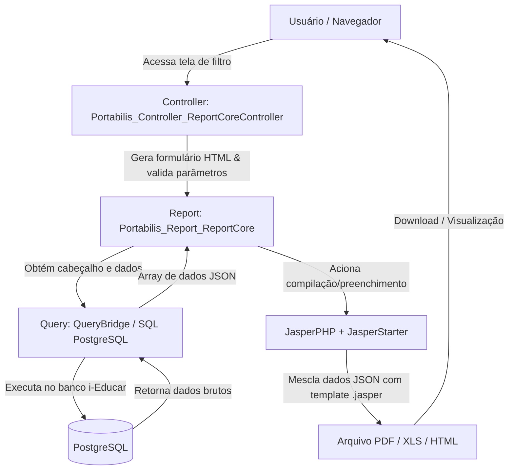
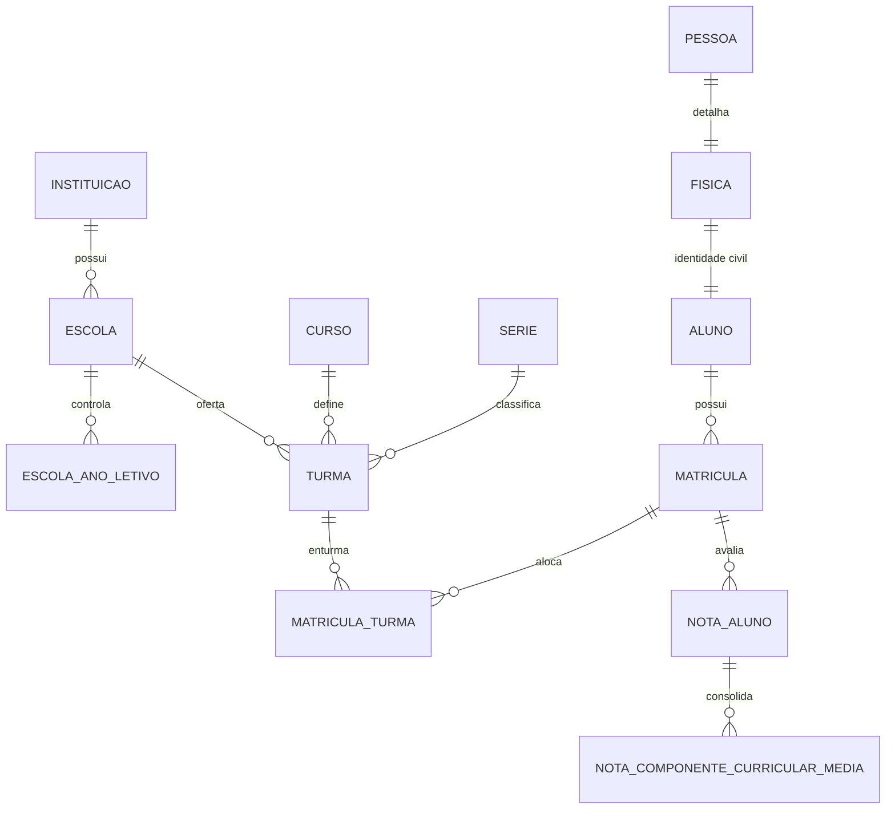

# 📘 Guia Base de Arquitetura e Criação de Relatórios (i-Educar Reports)

Este documento é a referência definitiva e blueprint arquitetural do pacote `i-educar-reports-package`. Ele detalha todo o ecossistema de geração de relatórios do **i-Educar**, o cabeçalho padrão, a estrutura das tabelas do banco de dados, as buscas SQL, o padrão de design visual (JasperReports) e modelos de código prontos para uso (boilerplates).

---

## 📑 Sumário

1. [Visão Geral da Arquitetura](#1-visão-geral-da-arquitetura)
2. [Estrutura de Pastas do Pacote](#2-estrutura-de-pastas-do-pacote)
3. [Cabeçalho Padrão do Sistema (System Header)](#3-cabeçalho-padrão-do-sistema-system-header)
4. [Estrutura de Tabelas e Schema do Banco de Dados](#4-estrutura-de-tabelas-e-schema-do-banco-de-dados)
5. [Padrão de Buscas no Banco de Dados (QueryBridge & SQL)](#5-padrão-de-buscas-no-banco-de-dados-querybridge--sql)
6. [Design Visual e Padrões de Layout (JasperReports / JRXML)](#6-design-visual-e-padrões-de-layout-jasperreports--jrxml)
7. [Template Base / Boilerplate Completo](#7-template-base--boilerplate-completo)
   - [Passo 1: Controller (Formulário e Filtros)](#passo-1-controller-ieducarviewsexemplocontrollerphp)
   - [Passo 2: Report (Orquestrador e DataSource)](#passo-2-report-ieducarreportsexemploreportphp)
   - [Passo 3: Query (Consulta SQL Segura)](#passo-3-query-ieducarqueriesqueryexemplophp)
   - [Passo 4: Layout JRXML (JasperReports)](#passo-4-layout-jrxml-ieducarreportsourcesexemplo-relatoriojrxml)
   - [Passo 5: Migration (Menu e Permissão)](#passo-5-migration-databasemigrationsxxxx_add_exemplo_menuphp)
8. [Comandos de Publicação e Compilação](#8-comandos-de-publicação-e-compilação)

---

## 1. Visão Geral da Arquitetura

O sistema de relatórios do i-Educar opera pela integração de cinco camadas:



### Tecnologias Utilizadas:
- **PHP / Laravel**: Framework base para service provider, comandos artisan e controllers.
- **JasperReports 6.x**: Engine de renderização de documentos complexos e pixel-perfect.
- **JasperStarter**: Utilitário em Java/CLI que compila arquivos `.jrxml` em binários `.jasper` e gera os documentos finais.
- **PostgreSQL**: SGBD relacional onde residem os esquemas `pmieducar`, `cadastro`, `modules`, `relatorio` e `public`.

---

## 2. Estrutura de Pastas do Pacote

| Diretório | Responsabilidade |
| :--- | :--- |
| `ieducar/Views/` | Contém os **Controllers** que desenham o formulário de filtros na intranet e recebem o POST da emissão. |
| `ieducar/Reports/` | Contém as classes de **Report**, que configuram os argumentos obrigatórios, definem qual template Jasper usar e agregam os dados (main, header, gráficos). |
| `ieducar/Queries/` | Contém as classes que herdam de `QueryBridge` ou traits com as consultas SQL puras e preparadas. |
| `ieducar/ReportSources/` | Arquivos `.jrxml` (código fonte do JasperReports) e `.jasper` (arquivos compilados). |
| `ieducar/ReportLogos/` | Imagens padrão (ex: `brasil.png`, brasões municipais). |
| `ieducar/Modifiers/` | Classes utilitárias para enriquecer ou manipular os dados antes do envio ao Jasper. |
| `src/Commands/` | Comandos Artisan (`community:reports:compile`, `community:reports:install`, `community:reports:link`). |
| `database/migrations/` | Migrações que cadastram os relatórios na tabela `menu` e no controle de permissões. |
| `database/sqls/` | Funções e views PostgreSQL necessárias para queries complexas de relatórios. |

---

## 3. Cabeçalho Padrão do Sistema (System Header)

O pacote dispõe de templates de cabeçalho padronizados em `ieducar/ReportSources/`:
- `header-portrait.jrxml` (Retrato - A4 padrão para documentos formais e fichas individuais)
- `header-landscape.jrxml` (Paisagem - A4 para atas, mapas de notas e listas de chamada)
- `header-portrait-listing.jrxml` (Retrato compacto para listagens de alunos)
- `header-landscape-listing.jrxml` (Paisagem compacto para listagens amplas)
- `header-portrait-report-card.jrxml` / `header-landscape-report-card.jrxml` (Específicos para boletins escolares)

### Como os dados do Cabeçalho chegam ao Relatório:
No método `getJsonData()` do seu Report, o cabeçalho é injetado via método herdado `$this->getSqlHeaderReport()`:

```php
public function getJsonData()
{
    return [
        'main' => $this->getQuery()->get($this->args),
        'header' => Portabilis_Utils_Database::fetchPreparedQuery($this->getSqlHeaderReport())
    ];
}
```

### Campos do Cabeçalho Padrão:
| Campo | Descrição |
| :--- | :--- |
| `nm_instituicao` | Nome do município / mantenedora (ex: *PREFEITURA MUNICIPAL DE EXEMPLO*) |
| `nm_responsavel` | Secretaria responsável (ex: *SECRETARIA MUNICIPAL DE EDUCAÇÃO*) |
| `nm_escola` | Nome da unidade escolar selecionada |
| `tipo_logradouro`, `logradouro`, `numero`, `bairro` | Endereço completo da escola |
| `fone_ddd`, `fone`, `cel_ddd`, `cel` | Telefones de contato |
| `email` | E-mail oficial da escola |
| `cidade`, `uf`, `cep` | Município, estado e CEP |
| `inep` | Código INEP da escola |

### Como invocar o Cabeçalho dentro do seu JRXML principal:
No seu template `.jrxml`, adicione na banda `<pageHeader>` ou `<groupHeader>` o subreport:

```xml
<subreport>
    <reportElement x="0" y="0" width="555" height="80" uuid="subreport-header"/>
    <subreportParameter name="logo">
        <subreportParameterExpression><![CDATA[$P{logo}]]></subreportParameterExpression>
    </subreportParameter>
    <subreportParameter name="titulo">
        <subreportParameterExpression><![CDATA["TÍTULO DO SEU RELATÓRIO"]]></subreportParameterExpression>
    </subreportParameter>
    <subreportParameter name="cod_instituicao">
        <subreportParameterExpression><![CDATA[$P{instituicao}]]></subreportParameterExpression>
    </subreportParameter>
    <subreportParameter name="cod_escola">
        <subreportParameterExpression><![CDATA[$P{escola}]]></subreportParameterExpression>
    </subreportParameter>
    <subreportParameter name="ano">
        <subreportParameterExpression><![CDATA[$P{ano}]]></subreportParameterExpression>
    </subreportParameter>
    <subreportParameter name="data_emissao">
        <subreportParameterExpression><![CDATA[$P{data_emissao}]]></subreportParameterExpression>
    </subreportParameter>
    <subreportParameter name="source">
        <subreportParameterExpression><![CDATA[$P{source}]]></subreportParameterExpression>
    </subreportParameter>
    <subreportExpression><![CDATA[$P{SUBREPORT_DIR} + "header-portrait.jasper"]]></subreportExpression>
</subreport>
```

---

## 4. Estrutura de Tabelas e Schema do Banco de Dados

O banco de dados do i-Educar utiliza PostgreSQL. A seguir estão os principais relacionamentos:

### Diagrama Entidade-Relacionamento Essencial



### Tabelas Principais:

#### 1. Institucional e Escolas
- `pmieducar.instituicao`: Entidade máxima (mantenedora/prefeitura).
  - Chave: `cod_instituicao`
- `pmieducar.escola`: Unidade escolar.
  - Chaves: `cod_escola`, `ref_cod_instituicao`
- `pmieducar.escola_ano_letivo`: Anos letivos abertos na escola.
  - Campos: `ref_cod_escola`, `ano`, `ativo` (1 = ativo)

#### 2. Cursos, Séries e Turmas
- `pmieducar.curso`: Cursos ofertados (ex: Ensino Fundamental, Educação Infantil).
  - Chaves: `cod_curso`, `ref_cod_instituicao`, `ativo`
- `pmieducar.serie`: Séries/anos (ex: 1º Ano, 2º Ano).
  - Chaves: `cod_serie`, `ref_cod_curso`, `ativo`
- `pmieducar.turma`: Entrurmação de alunos.
  - Chaves: `cod_turma`, `ref_ref_cod_escola`, `ref_cod_curso`, `ref_ref_cod_serie`, `ano`, `turma_turno_id`, `ativo`
- `pmieducar.turma_turno`: Turno da turma (Matutino, Vespertino, Noturno, Integral).
  - Chave: `id` (ou `cod_turma_turno`)

#### 3. Alunos e Matrículas
- `cadastro.pessoa`: Tabela global de pessoas físicas e jurídicas.
  - Campos: `idpes`, `nome`, `email`
- `cadastro.fisica`: Dados civis de pessoa física.
  - Campos: `idpes`, `data_nasc`, `sexo`, `nis_pis_pasep`, `cpf`
- `pmieducar.aluno`: Vínculo do aluno com pessoa física.
  - Chaves: `cod_aluno`, `ref_idpes`, `ativo`
- `pmieducar.matricula`: Registro escolar anual do aluno.
  - Chaves: `cod_matricula`, `ref_cod_aluno`, `ref_ref_cod_escola`, `ref_cod_curso`, `ref_ref_cod_serie`, `ano`, `aprovado` (1=Aprovado, 2=Reprovado, 3=Cursando, 4=Transferido, 6=Abandono), `dependencia` (boolean)
- `pmieducar.matricula_turma`: Vínculo do aluno na turma específica.
  - Campos: `ref_cod_matricula`, `ref_cod_turma`, `sequencial`, `remanejado`, `ativo`

#### 4. Notas, Médias e Frequências
- `modules.nota_aluno`: Cabeçalho das notas da matrícula.
  - Campos: `id`, `matricula_id`
- `modules.nota_componente_curricular_media`: Médias parciais e finais por disciplina.
  - Campos: `nota_aluno_id`, `componente_curricular_id`, `media`, `media_arredondada`
- `relatorio.view_componente_curricular`: View padronizada de disciplinas da turma.
  - Campos: `id`, `nome`, `abreviatura`, `ordenamento`, `cod_turma`
- `relatorio.view_situacao`: View padronizada do status final do aluno.
  - Campos: `cod_matricula`, `cod_turma`, `sequencial`, `texto_situacao_simplificado`

---

## 5. Padrão de Buscas no Banco de Dados (QueryBridge & SQL)

### Regras do `QueryBridge`:
1. Use **Heredoc** com aspas simples: `<<<'SQL' ... SQL;` para que o PHP não tente interpolar variáveis de string.
2. Substituições automáticas do QueryBridge:
   - `$P{parametro}`: É substituído pelo valor tipado. Se for string, adiciona aspas; se for booleano, vira `true`/`false`.
   - `$P!{parametro}`: É substituído diretamente em modo *raw* (atenção: use apenas para IDs seguros ou listas de inteiros).
3. **Filtros Opcionais Dinâmicos**: Sempre trate parâmetros que podem ser `0` (Todos):
   ```sql
   AND (CASE WHEN $P{escola} = 0 THEN TRUE ELSE escola.cod_escola = $P{escola} END)
   AND (CASE WHEN $P{curso} = 0 THEN TRUE ELSE curso.cod_curso = $P{curso} END)
   AND (CASE WHEN $P{turma} = 0 THEN TRUE ELSE turma.cod_turma = $P{turma} END)
   ```
4. **Regra de Desduplicação de Enturmação (Último Sequencial)**:
   Alunos remanejados ou com múltiplas enturmações no mesmo ano devem ser filtrados pelo maior sequencial:
   ```sql
   AND matricula_turma.sequencial = (
       SELECT MAX(mt.sequencial)
       FROM pmieducar.matricula_turma mt
       WHERE mt.ref_cod_matricula = matricula.cod_matricula
         AND mt.ref_cod_turma = turma.cod_turma
   )
   AND NOT verifica_existe_matricula_posterior_mesma_turma(view_situacao.cod_matricula, view_situacao.cod_turma)
   ```
5. **Tratamento de Strings e Acentuação**:
   Use a função `relatorio.get_texto_sem_caracter_especial(public.fcn_upper(pessoa.nome))` para manter ordenação alfabética segura (independente de acentos no PostgreSQL).

---

## 6. Design Visual e Padrões de Layout (JasperReports / JRXML)

Para manter a consistência visual em todos os relatórios do sistema, siga estas convenções de design:

### 📐 Dimensões de Página
- **Orientação Retrato (Portrait)**:
  - Largura: `595` pt, Altura: `842` pt (A4)
  - Margens: Esquerda: `20` pt, Direita: `20` pt, Superior: `20` pt, Inferior: `20` pt
  - Largura Útil (`columnWidth`): `555` pt
- **Orientação Paisagem (Landscape)**:
  - Largura: `842` pt, Altura: `595` pt (A4)
  - Margens: Esquerda: `20` pt, Direita: `20` pt, Superior: `20` pt, Inferior: `20` pt
  - Largura Útil (`columnWidth`): `802` pt

### 🎨 Tipografia e Cores
- **Família Tipográfica**: Sempre utilize `fontName="DejaVu Sans"` (fonte presente nativamente no container Linux e JasperStarter).
- **Hierarquia de Tamanhos**:
  - Título Principal do Relatório: `size="10"` a `12`, `isBold="true"`
  - Cabeçalho de Agrupamento (Turma, Curso, Escola): `size="8"`, `isBold="true"`
  - Cabeçalho de Colunas da Tabela (`columnHeader`): `size="7"` ou `8`, `isBold="true"`
  - Dados das Linhas (`detail`): `size="7"` ou `8`, `isBold="false"`
  - Totais e Rodapés: `size="7"` ou `8`, `isBold="true"`
- **Paleta de Cores Institucional**:
  - Cabeçalho de Tabela: Fundo cinza suave `#EDEDED` ou `#E0E0E0`, texto `#000000`.
  - Bordas de Células: `#CCCCCC` ou `#999999` com espessura `0.5` pt.
  - Linhas Alternadas (Zebrado): Fundo `#F7F7F7` nas linhas pares (`$V{REPORT_COUNT} % 2 == 0`).
  - Linha Separadora de Grupos: Traço sólido `#666666`, altura `1` pt.

### 📄 Rodapé Padrão
Na banda `<pageFooter>`, insira sempre a data de emissão à esquerda e a paginação à direita:
```xml
<textField>
    <reportElement x="0" y="4" width="200" height="12"/>
    <textElement><font fontName="DejaVu Sans" size="7"/></textElement>
    <textFieldExpression><![CDATA["Emitido em " + new java.text.SimpleDateFormat("dd/MM/yyyy HH:mm").format(new java.util.Date())]]></textFieldExpression>
</textField>
<textField evaluationTime="Report">
    <reportElement x="455" y="4" width="100" height="12"/>
    <textElement textAlignment="Right"><font fontName="DejaVu Sans" size="7"/></textElement>
    <textFieldExpression><![CDATA["Página " + $V{PAGE_NUMBER} + " de " + $V{PAGE_NUMBER}]]></textFieldExpression>
</textField>
```

---

## 7. Template Base / Boilerplate Completo

Copie e adapte os arquivos abaixo para criar um novo relatório em minutos:

### Passo 1: Controller (`ieducar/Views/ExemploRelatorioController.php`)

```php
<?php

class ExemploRelatorioController extends Portabilis_Controller_ReportCoreController
{
    /**
     * ID único do processo para controle de permissão e menus.
     * @var int
     */
    protected $_processoAp = 999999; // Altere para o código do seu relatório

    /**
     * Título exibido na barra superior e breadcrumb.
     * @var string
     */
    protected $_titulo = 'Relatório de Exemplo Padrão';

    protected function _preRender()
    {
        parent::_preRender();
        Portabilis_View_Helper_Application::loadStylesheet($this, 'intranet/styles/localizacaoSistema.css');
        $this->breadcrumb('Relatório de Exemplo', [
            'educar_index.php' => 'Escola',
        ]);
    }

    public function form()
    {
        // Inputs automáticos padrão do i-Educar com carregamento em cascata
        $this->inputsHelper()->dynamic(['ano', 'instituicao', 'escola', 'curso', 'serie', 'turma']);

        // Exemplo de campo select customizado
        $this->inputsHelper()->select('situacao', [
            'label' => 'Situação da Matrícula',
            'resources' => [
                0 => 'Todas',
                1 => 'Aprovado',
                2 => 'Reprovado',
                3 => 'Cursando',
                4 => 'Transferido',
                6 => 'Abandono'
            ],
            'required' => false,
            'value' => 0
        ]);
    }

    public function beforeValidation()
    {
        // Mapeia os dados enviados pelo formulário para os argumentos do relatório
        $this->report->addArg('ano', (int) $this->getRequest()->ano);
        $this->report->addArg('instituicao', (int) $this->getRequest()->ref_cod_instituicao);
        $this->report->addArg('escola', (int) $this->getRequest()->ref_cod_escola);
        $this->report->addArg('curso', (int) $this->getRequest()->ref_cod_curso);
        $this->report->addArg('serie', (int) $this->getRequest()->ref_cod_serie);
        $this->report->addArg('turma', (int) $this->getRequest()->ref_cod_turma);
        $this->report->addArg('situacao', (int) $this->getRequest()->situacao);
    }

    public function report()
    {
        return new ExemploRelatorioReport();
    }
}
```

---

### Passo 2: Report (`ieducar/Reports/ExemploRelatorioReport.php`)

```php
<?php

use iEducar\Reports\JsonDataSource;

class ExemploRelatorioReport extends Portabilis_Report_ReportCore
{
    use JsonDataSource;

    /**
     * Nome do arquivo .jrxml em ieducar/ReportSources/ (sem a extensão)
     */
    public function templateName()
    {
        return 'exemplo-relatorio';
    }

    /**
     * Validação de parâmetros obrigatórios antes de rodar a query
     */
    public function requiredArgs()
    {
        $this->addRequiredArg('ano');
        $this->addRequiredArg('instituicao');
    }

    /**
     * Montagem da estrutura de dados para o Jasper
     */
    public function getJsonData()
    {
        $query = new QueryExemploRelatorio();

        return [
            'main' => $query->get($this->args),
            'header' => Portabilis_Utils_Database::fetchPreparedQuery($this->getSqlHeaderReport())
        ];
    }
}
```

---

### Passo 3: Query (`ieducar/Queries/QueryExemploRelatorio.php`)

```php
<?php

class QueryExemploRelatorio extends QueryBridge
{
    /**
     * Parâmetros default caso o formulário envie vazio
     */
    protected function getDefaultData()
    {
        return [
            'escola' => 0,
            'curso' => 0,
            'serie' => 0,
            'turma' => 0,
            'situacao' => 0,
        ];
    }

    protected function query()
    {
        return <<<'SQL'
SELECT 
    escola.cod_escola,
    pessoa_escola.nome AS nome_escola,
    curso.nm_curso AS nome_curso,
    serie.nm_serie AS nome_serie,
    turma.cod_turma,
    turma.nm_turma AS nome_turma,
    turma_turno.nome AS periodo,
    aluno.cod_aluno,
    pessoa.nome AS nome_aluno,
    fisica.sexo,
    to_char(fisica.data_nasc, 'DD/MM/YYYY') AS data_nasc,
    matricula.cod_matricula,
    view_situacao.texto_situacao_simplificado AS situacao
FROM pmieducar.instituicao
INNER JOIN pmieducar.escola ON (escola.ref_cod_instituicao = instituicao.cod_instituicao)
INNER JOIN cadastro.pessoa pessoa_escola ON (pessoa_escola.idpes = escola.ref_idpes)
INNER JOIN pmieducar.escola_ano_letivo ON (escola_ano_letivo.ref_cod_escola = escola.cod_escola)
INNER JOIN pmieducar.turma ON (
    turma.ref_ref_cod_escola = escola.cod_escola 
    AND turma.ano = escola_ano_letivo.ano 
    AND turma.ativo = 1
)
INNER JOIN pmieducar.turma_turno ON (turma_turno.id = turma.turma_turno_id)
INNER JOIN pmieducar.curso ON (curso.cod_curso = turma.ref_cod_curso)
INNER JOIN pmieducar.serie ON (serie.cod_serie = turma.ref_ref_cod_serie)
INNER JOIN pmieducar.matricula_turma ON (matricula_turma.ref_cod_turma = turma.cod_turma AND matricula_turma.ativo = 1)
INNER JOIN pmieducar.matricula ON (
    matricula.cod_matricula = matricula_turma.ref_cod_matricula 
    AND matricula.ano = turma.ano 
    AND matricula.ativo = 1
)
INNER JOIN pmieducar.aluno ON (aluno.cod_aluno = matricula.ref_cod_aluno AND aluno.ativo = 1)
INNER JOIN cadastro.fisica ON (fisica.idpes = aluno.ref_idpes)
INNER JOIN cadastro.pessoa ON (pessoa.idpes = fisica.idpes)
INNER JOIN relatorio.view_situacao ON (
    view_situacao.cod_matricula = matricula.cod_matricula 
    AND view_situacao.cod_turma = turma.cod_turma 
    AND view_situacao.sequencial = matricula_turma.sequencial
)
WHERE instituicao.cod_instituicao = $P{instituicao}
  AND escola_ano_letivo.ano = $P{ano}
  AND (CASE WHEN $P{escola} = 0 THEN TRUE ELSE escola.cod_escola = $P{escola} END)
  AND (CASE WHEN $P{curso} = 0 THEN TRUE ELSE curso.cod_curso = $P{curso} END)
  AND (CASE WHEN $P{serie} = 0 THEN TRUE ELSE serie.cod_serie = $P{serie} END)
  AND (CASE WHEN $P{turma} = 0 THEN TRUE ELSE turma.cod_turma = $P{turma} END)
  AND (CASE WHEN $P{situacao} = 0 THEN TRUE ELSE view_situacao.cod_situacao = $P{situacao} END)
  AND matricula_turma.sequencial = (
      SELECT MAX(mt.sequencial)
      FROM pmieducar.matricula_turma mt
      WHERE mt.ref_cod_matricula = matricula.cod_matricula
        AND mt.ref_cod_turma = turma.cod_turma
  )
  AND NOT verifica_existe_matricula_posterior_mesma_turma(view_situacao.cod_matricula, view_situacao.cod_turma)
ORDER BY 
    pessoa_escola.nome,
    curso.nm_curso,
    serie.nm_serie,
    turma.nm_turma,
    relatorio.get_texto_sem_caracter_especial(public.fcn_upper(pessoa.nome))
SQL;
    }
}
```

---

### Passo 4: Layout JRXML (`ieducar/ReportSources/exemplo-relatorio.jrxml`)

```xml
<?xml version="1.0" encoding="UTF-8"?>
<jasperReport xmlns="http://jasperreports.sourceforge.net/jasperreports" 
              xmlns:xsi="http://www.w3.org/2001/XMLSchema-instance" 
              xsi:schemaLocation="http://jasperreports.sourceforge.net/jasperreports http://jasperreports.sourceforge.net/xsd/jasperreport.xsd" 
              name="exemplo-relatorio" 
              pageWidth="595" pageHeight="842" columnWidth="555" 
              leftMargin="20" rightMargin="20" topMargin="20" bottomMargin="20" 
              uuid="c1234567-89ab-cdef-0123-456789abcdef">
	<parameter name="ano" class="java.lang.Integer"><defaultValueExpression><![CDATA[0]]></defaultValueExpression></parameter>
	<parameter name="instituicao" class="java.lang.Integer"><defaultValueExpression><![CDATA[1]]></defaultValueExpression></parameter>
	<parameter name="escola" class="java.lang.Integer"><defaultValueExpression><![CDATA[0]]></defaultValueExpression></parameter>
	<parameter name="curso" class="java.lang.Integer"><defaultValueExpression><![CDATA[0]]></defaultValueExpression></parameter>
	<parameter name="serie" class="java.lang.Integer"><defaultValueExpression><![CDATA[0]]></defaultValueExpression></parameter>
	<parameter name="turma" class="java.lang.Integer"><defaultValueExpression><![CDATA[0]]></defaultValueExpression></parameter>
	<parameter name="logo" class="java.lang.String"><defaultValueExpression><![CDATA[""]]></defaultValueExpression></parameter>
	<parameter name="SUBREPORT_DIR" class="java.lang.String" isForPrompting="false"><defaultValueExpression><![CDATA[""]]></defaultValueExpression></parameter>
	<parameter name="data_emissao" class="java.lang.Integer"><defaultValueExpression><![CDATA[0]]></defaultValueExpression></parameter>
	<parameter name="source" class="java.lang.String"/>

	<queryString language="json"><![CDATA[main]]></queryString>

	<field name="cod_aluno" class="java.lang.Integer"/>
	<field name="nome_aluno" class="java.lang.String"/>
	<field name="sexo" class="java.lang.String"/>
	<field name="data_nasc" class="java.lang.String"/>
	<field name="situacao" class="java.lang.String"/>
	<field name="nome_escola" class="java.lang.String"/>
	<field name="nome_curso" class="java.lang.String"/>
	<field name="nome_serie" class="java.lang.String"/>
	<field name="nome_turma" class="java.lang.String"/>
	<field name="cod_turma" class="java.lang.Integer"/>
	<field name="cod_escola" class="java.lang.Integer"/>

	<variable name="total_alunos_turma" class="java.lang.Integer" resetType="Group" resetGroup="grupo_turma" calculation="Count">
		<variableExpression><![CDATA[$F{cod_aluno}]]></variableExpression>
	</variable>

	<!-- Agrupamento por Turma -->
	<group name="grupo_turma" isStartNewPage="true" isResetPageNumber="true">
		<groupExpression><![CDATA[$F{cod_turma}]]></groupExpression>
		<groupHeader>
			<band height="125">
				<!-- Invocação do Cabeçalho Padrão do Sistema -->
				<subreport>
					<reportElement x="0" y="0" width="555" height="80" uuid="subreport-cabecalho"/>
					<subreportParameter name="logo"><subreportParameterExpression><![CDATA[$P{logo}]]></subreportParameterExpression></subreportParameter>
					<subreportParameter name="titulo"><subreportParameterExpression><![CDATA["RELAÇÃO DE ALUNOS"]]></subreportParameterExpression></subreportParameter>
					<subreportParameter name="cod_instituicao"><subreportParameterExpression><![CDATA[$P{instituicao}]]></subreportParameterExpression></subreportParameter>
					<subreportParameter name="cod_escola"><subreportParameterExpression><![CDATA[$F{cod_escola}]]></subreportParameterExpression></subreportParameter>
					<subreportParameter name="ano"><subreportParameterExpression><![CDATA[$P{ano}]]></subreportParameterExpression></subreportParameter>
					<subreportParameter name="data_emissao"><subreportParameterExpression><![CDATA[$P{data_emissao}]]></subreportParameterExpression></subreportParameter>
					<subreportParameter name="source"><subreportParameterExpression><![CDATA[$P{source}]]></subreportParameterExpression></subreportParameter>
					<subreportExpression><![CDATA[$P{SUBREPORT_DIR} + "header-portrait.jasper"]]></subreportExpression>
				</subreport>

				<!-- Dados da Turma / Informações de Seção -->
				<line>
					<reportElement x="0" y="84" width="555" height="1" forecolor="#CCCCCC" uuid="sep-01"/>
				</line>
				<textField>
					<reportElement x="0" y="88" width="270" height="12" uuid="txt-curso"/>
					<textElement><font fontName="DejaVu Sans" size="8" isBold="true"/></textElement>
					<textFieldExpression><![CDATA["Curso: " + $F{nome_curso} + " - " + $F{nome_serie}]]></textFieldExpression>
				</textField>
				<textField>
					<reportElement x="280" y="88" width="275" height="12" uuid="txt-turma"/>
					<textElement textAlignment="Right"><font fontName="DejaVu Sans" size="8" isBold="true"/></textElement>
					<textFieldExpression><![CDATA["Turma: " + $F{nome_turma}]]></textFieldExpression>
				</textField>

				<!-- Cabeçalho das Colunas da Tabela -->
				<rectangle>
					<reportElement x="0" y="106" width="555" height="18" backcolor="#EDEDED" uuid="bg-header-cols"/>
					<graphicElement><pen lineWidth="0.5" lineColor="#CCCCCC"/></graphicElement>
				</rectangle>
				<staticText>
					<reportElement x="5" y="109" width="45" height="12" uuid="th-cod"/>
					<textElement><font fontName="DejaVu Sans" size="8" isBold="true"/></textElement>
					<text><![CDATA[Cód.]]></text>
				</staticText>
				<staticText>
					<reportElement x="55" y="109" width="280" height="12" uuid="th-nome"/>
					<textElement><font fontName="DejaVu Sans" size="8" isBold="true"/></textElement>
					<text><![CDATA[Nome do Aluno]]></text>
				</staticText>
				<staticText>
					<reportElement x="340" y="109" width="40" height="12" uuid="th-sexo"/>
					<textElement textAlignment="Center"><font fontName="DejaVu Sans" size="8" isBold="true"/></textElement>
					<text><![CDATA[Sexo]]></text>
				</staticText>
				<staticText>
					<reportElement x="385" y="109" width="70" height="12" uuid="th-nasc"/>
					<textElement textAlignment="Center"><font fontName="DejaVu Sans" size="8" isBold="true"/></textElement>
					<text><![CDATA[Dt. Nasc.]]></text>
				</staticText>
				<staticText>
					<reportElement x="460" y="109" width="90" height="12" uuid="th-sit"/>
					<textElement textAlignment="Center"><font fontName="DejaVu Sans" size="8" isBold="true"/></textElement>
					<text><![CDATA[Situação]]></text>
				</staticText>
			</band>
		</groupHeader>
		<groupFooter>
			<band height="25">
				<line>
					<reportElement x="0" y="4" width="555" height="1" forecolor="#CCCCCC" uuid="sep-tot"/>
				</line>
				<textField>
					<reportElement x="0" y="8" width="555" height="14" uuid="txt-tot"/>
					<textElement textAlignment="Right"><font fontName="DejaVu Sans" size="8" isBold="true"/></textElement>
					<textFieldExpression><![CDATA["Total de alunos na turma: " + $V{total_alunos_turma}]]></textFieldExpression>
				</textField>
			</band>
		</groupFooter>
	</group>

	<!-- Linhas da Tabela (Detail) com Zebrado Automático -->
	<detail>
		<band height="14" splitType="Stretch">
			<rectangle>
				<reportElement stretchType="RelativeToTallestObject" x="0" y="0" width="555" height="14" backcolor="#F7F7F7" uuid="zebrado">
					<printWhenExpression><![CDATA[new Boolean($V{REPORT_COUNT}.intValue() % 2 == 0)]]></printWhenExpression>
				</reportElement>
				<graphicElement><pen lineWidth="0.0"/></graphicElement>
			</rectangle>
			<textField>
				<reportElement x="5" y="1" width="45" height="12" uuid="td-cod"/>
				<textElement><font fontName="DejaVu Sans" size="7"/></textElement>
				<textFieldExpression><![CDATA[$F{cod_aluno}]]></textFieldExpression>
			</textField>
			<textField isStretchWithOverflow="true">
				<reportElement x="55" y="1" width="280" height="12" uuid="td-nome"/>
				<textElement><font fontName="DejaVu Sans" size="7"/></textElement>
				<textFieldExpression><![CDATA[$F{nome_aluno}]]></textFieldExpression>
			</textField>
			<textField isBlankWhenNull="true">
				<reportElement x="340" y="1" width="40" height="12" uuid="td-sexo"/>
				<textElement textAlignment="Center"><font fontName="DejaVu Sans" size="7"/></textElement>
				<textFieldExpression><![CDATA[$F{sexo}]]></textFieldExpression>
			</textField>
			<textField isBlankWhenNull="true">
				<reportElement x="385" y="1" width="70" height="12" uuid="td-nasc"/>
				<textElement textAlignment="Center"><font fontName="DejaVu Sans" size="7"/></textElement>
				<textFieldExpression><![CDATA[$F{data_nasc}]]></textFieldExpression>
			</textField>
			<textField isBlankWhenNull="true">
				<reportElement x="460" y="1" width="90" height="12" uuid="td-sit"/>
				<textElement textAlignment="Center"><font fontName="DejaVu Sans" size="7"/></textElement>
				<textFieldExpression><![CDATA[$F{situacao}]]></textFieldExpression>
			</textField>
		</band>
	</detail>

	<!-- Rodapé de Página -->
	<pageFooter>
		<band height="20" splitType="Stretch">
			<line>
				<reportElement x="0" y="2" width="555" height="1" forecolor="#CCCCCC" uuid="sep-foot"/>
			</line>
			<textField>
				<reportElement x="0" y="5" width="250" height="12" uuid="txt-dt"/>
				<textElement><font fontName="DejaVu Sans" size="7"/></textElement>
				<textFieldExpression><![CDATA["Emitido em: " + new java.text.SimpleDateFormat("dd/MM/yyyy HH:mm").format(new java.util.Date())]]></textFieldExpression>
			</textField>
			<textField>
				<reportElement x="455" y="5" width="100" height="12" uuid="txt-pg"/>
				<textElement textAlignment="Right"><font fontName="DejaVu Sans" size="7"/></textElement>
				<textFieldExpression><![CDATA["Página " + $V{PAGE_NUMBER}]]></textFieldExpression>
			</textField>
		</band>
	</pageFooter>
</jasperReport>
```

---

### Passo 5: Migration (`database/migrations/2026_10_03_000000_add_exemplo_relatorio_menu.php`)

```php
<?php

use App\Menu;
use Illuminate\Database\Migrations\Migration;

class AddExemploRelatorioMenu extends Migration
{
    public function up()
    {
        // 999922 é o agrupador padrão de Relatórios da Escola no i-Educar
        $parentMenu = Menu::query()->where('old', 999922)->first();

        Menu::query()->updateOrCreate(['old' => 999999], [
            'parent_id' => $parentMenu ? $parentMenu->getKey() : null,
            'process' => 999999,
            'title' => 'Relatório de Exemplo Padrão',
            'order' => 10,
            'parent_old' => 999922,
            'link' => '/module/Reports/ExemploRelatorio'
        ]);
    }

    public function down()
    {
        Menu::query()->where('old', 999999)->delete();
    }
}
```

---

## 8. Comandos de Publicação e Compilação

Após criar os arquivos acima, execute na raiz da sua instalação do i-Educar:

```bash
# 1. Cria ou atualiza o link simbólico das views do pacote
php artisan community:reports:link

# 2. Compila os arquivos .jrxml em binários .jasper de alta performance
php artisan community:reports:compile

# 3. Executa a migration para cadastrar a tela no menu e permissões
php artisan migrate
```

Pronto! O novo relatório estará imediatamente acessível no menu do i-Educar em `/module/Reports/ExemploRelatorio`.
